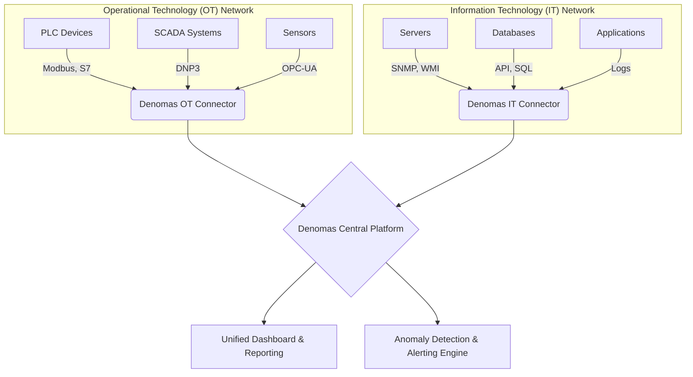

### Introduction: The Inevitable Intersection of IT and OT Worlds

With the Industry 4.0 revolution, two previously isolated worlds are now intertwined: Information Technology (IT) and Operational Technology (OT). OT networks, which manage critical operations like factory automation, power plants, and smart city infrastructures, are being connected to IT systems to achieve goals like data analytics, remote management, and efficiency gains. However, this convergence brings a massive challenge: How can we effectively monitor and manage these two different worlds? Monitoring philosophies designed for IT often conflict with the unique and sensitive nature of OT.

### Part 1: The 5 Core Challenges of Industrial (OT) Monitoring

Monitoring OT environments is fundamentally different from monitoring a web server. The core challenges include:

1.  **Diverse and Proprietary Protocols:** While the IT world relies on standardized protocols like SNMP and WMI, the OT field is filled with dozens of different, often proprietary and closed protocols like Modbus, DNP3, Profinet, and S7. Traditional monitoring tools cannot "speak" these languages.

2.  **Sensitive and Legacy Systems:** Many PLCs (Programmable Logic Controllers) or RTUs (Remote Terminal Units) are devices that have been operating in the field for decades, with low processing power and lacking modern security patches. Installing a monitoring "agent" on these systems is impossible, and even an aggressive network scan (port scanning) can cause these devices to crash or malfunction.

3.  **Extremely High Data Volume and Real-Time Needs:** Imagine data flowing from thousands of sensors on a production line in milliseconds. This data needs to be collected and processed instantly, and any abnormal situation must be detected within seconds. The polling intervals of traditional IT monitoring tools are insufficient for this speed.

4.  **Security and Network Isolation:** Due to high-security requirements, OT networks are often "air-gapped" (physically isolated from the internet) or operate behind very strict firewall rules. This poses a significant obstacle to collecting monitoring data in a central system.

5.  **Disjointed and Non-Unified Tools:** Often, each machine or system (e.g., from Siemens, Honeywell, Schneider Electric) comes with its own monitoring software. This means that dozens of different screens must be monitored in the control room, making it impossible to get a holistic operational view.

### Part 2: Why Do Traditional IT Monitoring Tools Fall Short?

Popular IT monitoring tools on the market are often ineffective against these challenges:

*   **IT-Focused Solutions like Zabbix, Nagios, PRTG:** These tools are excellent for monitoring servers and network devices. However, their core design is based on IT protocols. Monitoring a Modbus device often requires complex and fragile "custom script" solutions. Their agent-based approaches and active scanning methods pose a direct risk to sensitive OT devices.

*   **General-Purpose Giants like Solarwinds, Microfocus:** While these platforms offer extensive feature sets, they are often cumbersome, have high licensing costs, and are "too generic" for the niche requirements of OT. Supporting even a single industrial protocol can require weeks of professional services and configuration. This is impractical for industrial environments that need to be fast and flexible.

### Part 3: The Denomas Approach: A Unified Platform Designed for OT

Denomas was designed precisely to fill this gap. It addresses each challenge where traditional tools fall short:

*   **Protocol Flexibility:** Denomas has native connectors that understand industrial protocols. Even for an unknown or custom protocol, it can quickly make sense of any incoming data stream thanks to flexible custom parsers.

*   **Agentless and Passive Auditing:** Our platform never installs an "agent" on OT networks. Instead, it collects information by passively listening to network traffic (via network taps/span ports) or by communicating with devices in their own language using secure, read-only commands. This ensures the stability and security of sensitive systems.

*   **High-Performance Data Processing Engine:** The core of Denomas is optimized to efficiently process time-series data and high-volume logs. This allows it to perform real-time anomaly detection by processing millions of data points in seconds and to store data for long-term trend analysis.

*   **Unified IT/OT View:** Denomas combines data collected from isolated OT networks with data from the IT infrastructure (servers, databases, applications) on a single central platform. This allows you to instantly see, for example, that a failure on a production line was triggered by a specific service on a specific server.

### Conclusion: The Power of Understanding, Not Just Monitoring

In conclusion, monitoring industrial systems is much more than just checking if they are "up" or "down." Success comes from making operational "sense" by bringing together data from thousands of different sources and establishing the relationship between them. Traditional IT tools may succeed at data collection, but they miss the context and meaning. Denomas, by speaking the language of the OT world, transforms data into information, and information into actionable insights. This is not just a monitoring tool; it is an operational intelligence platform.

---

## Related Projects

Explore how Denomas addresses specific challenges in these areas:

*   **[Denomas Audit Information Management Automation Software](/project/denomas-audit-automation/)**: Discover how we automate compliance and configuration auditing across diverse IT/OT environments.
*   **[Denomas Management Automation Platform](/project/denomas-management-automation/)**: Learn about our integrated platform for infrastructure management, CI/CD, and SDLC automation.
*   **[Denomas Security Automation Software](/project/denomas-security-automation/)**: See how we enhance security posture by automating compliance with international security standards.