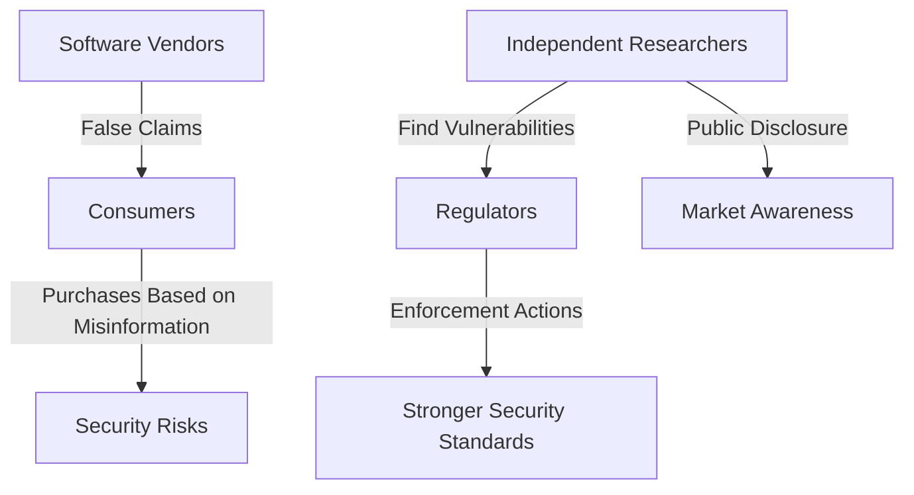

## Introduction: The Unseen Hand Shaping Software Accountability

In an era dominated by software platforms and digital systems, ensuring their accountability is paramount. While much attention is given to regulatory frameworks, less is paid to the mechanisms that truly enable agencies like the Federal Trade Commission (FTC) to police the security and privacy properties of information technology effectively. This article argues that independent research—including vulnerability discovery and reverse engineering—is not merely supplementary but a crucial, often unseen, force in shaping government regulations.

## The Indispensable Role of Independent Research

Independent security researchers, investigative journalists, academics, and advocacy organizations serve as vital watchdogs. They uncover vulnerabilities, privacy abuses, and deceptive practices that might otherwise remain hidden. Their findings often serve as the initial trigger for enforcement actions, strengthening regulatory efforts and enhancing public awareness of software risks.

### Case Studies: Independent Research as a Regulatory Catalyst

Several high-profile FTC actions underscore the direct impact of independent research:

*   **The Zoom Settlement (2021):** Independent researchers exposed Zoom's false claims of "end-to-end encryption," leading to a landmark FTC settlement that mandated significant security improvements.
*   **The Twitter Data Misuse Case (2022):** Journalists and researchers revealed Twitter's misuse of phone numbers collected for two-factor authentication (2FA) for targeted advertising. This discovery resulted in a $150 million FTC fine, highlighting the power of adversarial research in uncovering deceptive practices.
*   **Google’s COPPA Violation (2019):** Privacy advocates and independent researchers found that YouTube was collecting data on children under 13 without parental consent, leading to a $170 million FTC fine and new compliance measures.

These cases are not isolated incidents but exemplify a pattern where independent scrutiny provides governments with the critical intelligence needed for effective enforcement.

## Real-World Impact: Exposing Systemic Failures

Consider the case of a university student who, upon moving to a new city, received unsolicited marketing calls. Through diligent investigation, the student uncovered a significant security vulnerability in municipal systems that exposed citizen data. Despite responsible disclosure, officials initially dismissed the findings, asking, "Why are you even looking into this?" This incident highlights a systemic issue: the lack of structured guidelines for handling security disclosures from independent researchers. Without proper regulations, opportunities to improve security at a grassroots level are often missed.

## Economic and Legal Justifications for Protecting Independent Research

Independent research often faces legal challenges under laws like the Digital Millennium Copyright Act (DMCA) and the Computer Fraud and Abuse Act (CFAA). However, strong economic and legal theories support its protection:

### Economic Theory: Correcting Market Asymmetry

Software markets suffer from information asymmetry; consumers struggle to evaluate security and privacy claims. Independent research acts as a corrective force, providing the transparency that the market often fails to generate organically.

### Legal Theory: The First Amendment and the Right to Inquire

Research and investigative reporting on security issues fall under the First Amendment’s protection of free speech. Courts increasingly recognize security research as a form of scientific inquiry, which should be legally protected rather than criminalized.

## Policy Interventions: Strengthening the Research Ecosystem

Given its pivotal role, policymakers must actively protect and encourage independent research. We propose several interventions:

1.  **Strengthen Legal Protections:** Amend the DMCA and CFAA to include explicit exemptions for good-faith security research and implement "safe harbor" provisions.
2.  **Establish Public-Private Reporting Frameworks:** Mandate government agencies to accept vulnerability disclosures and create publicly accessible databases.
3.  **Provide Research Funding:** Establish government-backed grants for independent security research and encourage institutional support.
4.  **Require Transparency:** Enforce clear labeling for software security/privacy features and mandate independent audits for major platforms.

## Conclusion: A Public Good for a Secure Digital Future

Independent security research is a critical public good that holds software accountable and drives regulatory enforcement. Despite facing legal and financial hurdles, these researchers are indispensable. Policymakers must recognize and protect their work, ensuring that those who uncover security and privacy risks can continue to contribute to a more secure and transparent digital ecosystem for all.
