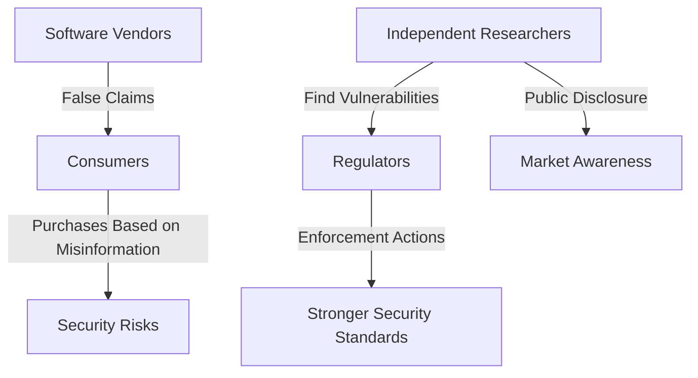
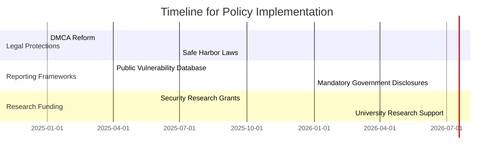

# Software Screws Around, Reverse Engineering FindsOut: How Independent, Adversarial Research Informs Government Regulation

## Introduction

For all the discussion on how best to regulate software platforms and systems, little attention is paid to how software is actually held accountable today. What mechanisms enable agencies like the Federal Trade Commission (FTC) to police the security and privacy properties of information technology effectively?

It is often assumed that independent research—including vulnerability discovery and reverse engineering—plays some role, but its overall prominence has been underexamined. Our review of FTC actions in software security and privacy over the past several years reveals that a significant portion—between a quarter and a third—of all FTC actions owe their discovery directly to the input of independent researchers.

This underscores independent research as a crucial regulatory partner, elevating its importance beyond what has been previously assumed. We explore why this is unsurprising from an economic and legal theory perspective and propose a series of law and policy interventions to strengthen the independent software research ecosystem in light of its pivotal regulatory role.

## The Role of Independent Research in Software Accountability

Independent security researchers, journalists, academics, and advocacy organizations play an essential role in uncovering vulnerabilities and privacy abuses that might otherwise go unnoticed. Their work informs enforcement actions, strengthens regulatory efforts, and enhances public awareness of software risks.

### Case Studies of FTC Actions Informed by Independent Research

#### 1. **The Zoom Settlement (2021)**

Independent researchers discovered that Zoom falsely claimed to offer "end-to-end encryption" for video calls. This led to FTC scrutiny and a landmark settlement that required Zoom to improve its security measures significantly.

#### 2. **The Twitter Data Misuse Case (2022)**

Journalists and researchers found that Twitter had misused phone numbers collected for two-factor authentication (2FA) for targeted advertising. The FTC fined Twitter $150 million, a case that highlighted the role of adversarial research in uncovering deceptive practices.

#### 3. **Google’s COPPA Violation (2019)**

Privacy advocates and independent researchers found that YouTube was collecting data on children under 13 without parental consent, leading to an FTC fine of $170 million and new compliance measures.

These cases exemplify how independent research serves as a regulatory trigger, providing the government with crucial information for enforcement actions.

## Economic and Legal Justifications for Protecting Independent Research

Independent research has often faced legal challenges under laws like the Digital Millennium Copyright Act (DMCA) and the Computer Fraud and Abuse Act (CFAA), which can be weaponized against researchers. However, economic and legal theories support its protection.

### **Economic Theory: The Market Failure in Software Transparency**

Software markets suffer from information asymmetry—users cannot easily evaluate security and privacy claims. Independent research acts as a corrective force, providing transparency that the market fails to generate on its own.

### **Legal Theory: The First Amendment and the Right to Research**

Research and investigative reporting on security issues fall under the First Amendment’s protection of free speech. Courts have increasingly recognized security research as a form of scientific inquiry, which should be legally protected rather than criminalized.

## Policy Interventions to Strengthen Independent Software Research

Given the crucial role that independent research plays in software regulation, policymakers must adopt measures to protect and encourage it. We propose several interventions:

### **1. Strengthen Legal Protections for Security Research**

- Amend the DMCA and CFAA to include explicit exemptions for good-faith security research.

- Implement "safe harbor" provisions to protect researchers from legal threats when reporting vulnerabilities responsibly.

### **2. Establish a Public-Private Vulnerability Reporting Framework**

- Mandate that government agencies accept vulnerability disclosures from independent researchers and act on them within a set timeframe.

- Create a publicly accessible vulnerability disclosure database, improving transparency and accountability.

### **3. Provide Research Funding and Grants**

- Establish government-backed grants for independent security research, similar to scientific research funding.

- Encourage universities and research institutions to support security research programs without fear of legal repercussions.

### **4. Require Transparency in Software Security and Privacy Claims**

- Enforce clear labeling requirements for software security and privacy features.

- Require independent audits for major platforms handling sensitive user data.

## Conclusion

Independent security research plays a critical role in holding software accountable and ensuring regulatory enforcement. The FTC and other agencies rely heavily on discoveries made by independent actors, yet these researchers often face legal and financial challenges.

Policymakers must recognize and protect independent research as a public good, ensuring that those who uncover security and privacy risks can continue their work without fear of retribution. By adopting targeted legal and policy interventions, governments can strengthen this essential regulatory partnership and create a more secure digital ecosystem for all.

This framework not only supports independent research but also strengthens the overall security and transparency of software platforms, benefiting users and regulators alike.
