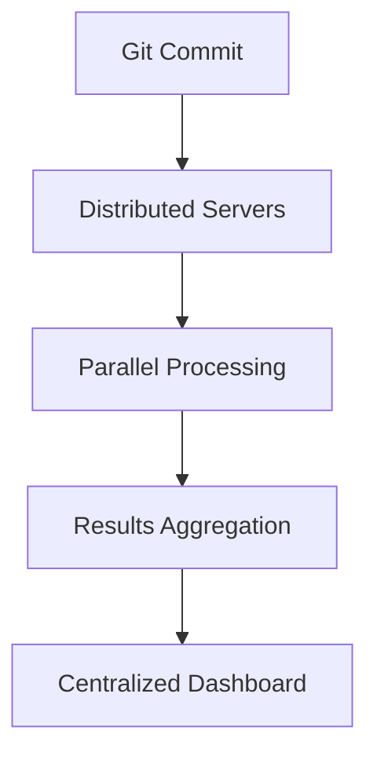
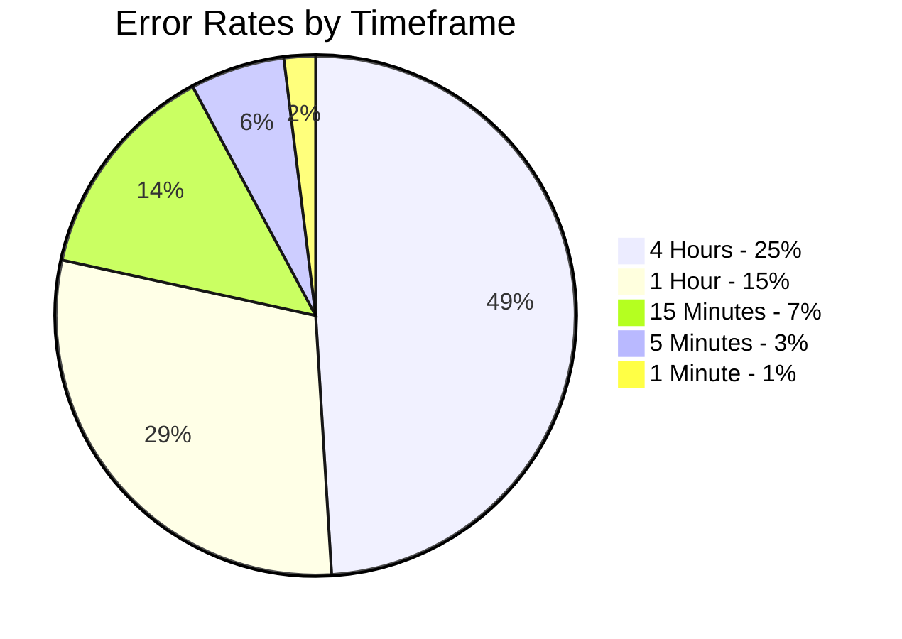

# **Scientific Methodology Proposal: Comprehensive Testing Framework for Cryptocurrency Algorithmic Trading Strategies**

## **Abstract**
This paper presents a scalable and automated testing framework for cryptocurrency algorithmic trading strategies. By evaluating five years of historical data (2020–2024) across major marketplaces (Binance, OKX, Gate.io), market types (spot, futures), and listed assets, we aim to assess the feasibility of manual testing and highlight the benefits of automation using DigiTuccar. Our findings reveal significant limitations in manual testing regarding time, accuracy, and computational power, while demonstrating how DigiTuccar revolutionizes the process.

---

## **1. Introduction**
Cryptocurrency markets are fast-paced, highly volatile, and data-intensive. Algorithmic trading strategies must undergo rigorous backtesting to evaluate their robustness and profitability. However, manual testing methods are time-consuming and prone to inaccuracies. This study explores the requirements for backtesting all available trading opportunities from 2020 to 2024 and compares manual efforts against DigiTuccar’s automated distributed framework.

---

## **2. Manual Testing Feasibility**

### **2.1 Assumptions for Manual Testing**
- **Marketplaces:** Binance, OKX, Gate.io (3 marketplaces)
- **Market Types:** Spot and Futures (2 types)
- **Assets:** ~300 listed assets per marketplace (BTC, ETH, etc.)
- **Time Period:** 5 years (2020–2024), analyzed monthly.
- **Opportunities:** Every 1-minute candlestick, 24/7 trading.

### **2.2 Total Time Required**

#### Formula:
\[
\text{Total Time (Hours)} = \text{Marketplaces} \times \text{Market Types} \times \text{Assets} \times \text{Candlesticks Per Year} \times 5
\]

#### Calculation:


- Candlesticks per year = \( 365 \times 24 \times 60 = 525,600 \)




- Total Time:
\[
3 \times 2 \times 300 \times 525,600 \times 5 = 4,734,000,000 \text{ candlesticks}
\]

If each candlestick takes 1 second to test manually:
\[
\frac{4,734,000,000}{3600} = 1,315,000 \text{ hours (150 years)}.
\]


---

## **3. Error Rates in Different Timeframes**

#### Formula:


\[
R_{err}(T, \Delta t) = \frac{\int_{t=0}^{T} \left | \frac{\partial P(t)}{\partial t} - \frac{\Delta P(t, \Delta t)}{\Delta t} \right | \, dt}{\int_{t=0}^{T} \left |\frac{\partial P(t)}{\partial t}\right | \, dt} \cdot 100
\]



#### **Comparison of Timeframes:**

| Timeframe       | Error Rate (%) |
|-----------------|----------------|
| 4 Hours         | 25             |
| 1 Hour          | 15             |
| 15 Minutes      | 7              |
| 5 Minutes       | 3              |
| 1 Minute        | 1              |

---

## **4. Computational Power Analysis**

#### **1-Minute Backtesting**

1. **Data Size:**
   - \( 300 \text{ assets} \times 3 \text{ marketplaces} \times 525,600 \text{ candlesticks/year} \times 5 \text{ years} = 2.36 \text{ billion candlesticks.} \)

2. **Processing Requirements:**
   - Single-thread processing: \( \approx 2.36 \text{ million seconds (27.3 days).} \)
   - With 100 parallel threads: \( \approx 6.5 \text{ hours.} \)

---

## **5. DigiTuccar’s Framework**

### **Advantages**

1. **Parallel Processing:**
   - Distributes workloads across multiple cloud and in-house servers, significantly reducing time.

2. **Automated Workflows:**
   - Triggered by Git commits, ensuring tests are conducted after each strategy update.

3. **Cloud Optimization:**
   - Data is compressed, reducing bandwidth costs and improving efficiency.

4. **Centralized Monitoring:**
   - Results are accessible in real time via dashboards.

5. **Error Reduction:**
   - Automated systems minimize manual errors.

---

## **6. Results Comparison**

### **Time and Error Rate Analysis**

| Method           | Timeframe    | Error Rate (%) | Time Taken  |
|------------------|--------------|----------------|-------------|
| Manual Testing   | 4 Hours      | 25             | 150 years   |
| DigiTuccar       | 4 Hours      | 25             | 6.5 hours   |
| DigiTuccar       | 1 Minute     | 1              | 6.5 hours   |

---

## **7. Visualization**

### **Mermaid Workflow**

---

### **Timeframe Error Comparison**

---

## **8. Future Enhancements**

- **AI Integration:** Predictive analytics for optimal parameter tuning.
- **Expanded Market Coverage:** Adding DeFi protocols and NFT marketplaces.
- **Enhanced Visualizations:** Interactive heatmaps for strategy performance.

---

## **9. Conclusion**
DigiTuccar revolutionizes algorithmic trading backtesting, offering unmatched speed, accuracy, and scalability. By automating workflows and leveraging distributed systems, DigiTuccar empowers developers to test strategies comprehensively and efficiently.

---
