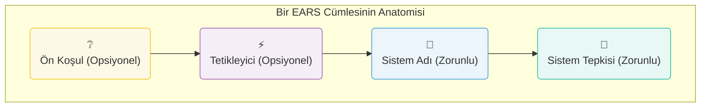

[Seviye: Orta]

Merhaba! Kitabımızın bu bölümünde EARS'ı bir arabanın motorunu inceler gibi parçalarına ayıracağız. Ama endişelenmeyin, ellerimizi kirletmeyeceğiz! Aksine, bu motorun ne kadar basit ve akıllıca tasarlandığını görünce şaşıracaksınız.

### 5.1. EARS Felsefesi: "Gizli Titizlik" (Stealth Rigor)

EARS'ın en sevdiğim yanı, size karmaşık diyagramlar veya ezberlenmesi zor kurallar öğretmeye çalışmamasıdır. Felsefesi basittir: İnsanların zaten bildiği basit kelimeleri (`ne zaman`, `eğer`, `boyunca` gibi) alıp, onları her zaman aynı sırada kullanmalarını sağlayarak, farkında bile olmadan son derece titiz ve net düşünmelerini sağlamak. Buna "Gizli Titizlik" diyoruz. Siz sadece basit bir cümle kurduğunuzu sanırsınız, ama aslında mühendislik harikası bir gereksinim yazmış olursunuz!

### 5.2. EARS Cümlesinin Yapı Taşları

Bir EARS cümlesi, legonun parçaları gibidir. Her zaman belirli bir sırayla bir araya gelirler. İşte o sihirli formül ve görsel dökümü:

* **Ön Koşul (Precondition):** Sistem belirli bir durumdayken... (Genellikle `While / Boyunca` ile başlar)
* **Tetikleyici (Trigger):** Belirli bir olay olduğunda... (Genellikle `When / -dığında` ile başlar)
* **Sistem Adı (System Name):** İşi kimin yapacağını söyler. (Örn: "Akıllı Kahve Makinesi")
* **Sistem Tepkisi (System Response):** Sistemin tam olarak ne yapacağını söyler.

### 5.3. Altın Kural: Sadece BİR Sistem Adı!

Bir gereksinim yazarken yapabileceğiniz en büyük hatalardan biri, sorumluluğu dağıtmaktır. "Makine kahveyi yapacak ve uygulama bildirim gönderecek" gibi bir cümle, iki farklı işi tek bir gereksinime sıkıştırır.

EARS'ın altın kuralı şudur: **Her gereksinimde sadece ve sadece BİR sistem adı olmalıdır.** Bu, o gereksinimin test edilebilir ve atomik olmasını sağlar.

* **Hatalı:** `Kullanıcı 'demle' düğmesine bastığında, Akıllı Kahve Makinesi kahveyi demleyecek ve Mobil Uygulama 'kahveniz hazır' bildirimi gönderecektir.` (İki farklı sistem, iki farklı iş)
* **Doğru (2 ayrı gereksinim):**
    1.  `Kullanıcı 'demle' düğmesine bastığında, Akıllı Kahve Makinesi, kahveyi demleyecektir.`
    2.  `Kahve demleme işlemi tamamlandığında, Akıllı Kahve Makinesi, Mobil Uygulamaya 'hazır' sinyali gönderecektir.`
    3.  `Mobil Uygulama, 'hazır' sinyalini aldığında, kullanıcıya 'kahveniz hazır' bildirimi gösterecektir.`

{}
**Bu Bölümden Akılda Kalanlar**

* EARS, sizi fark ettirmeden daha net düşünmeye iten "Gizli Titizlik" felsefesine dayanır.
* Bir EARS cümlesi en fazla dört basit parçadan oluşur: Ön Koşul, Tetikleyici, Sistem Adı ve Sistem Tepkisi.
* Altın Kural: Her zaman tek bir sistem adı kullanın. Bu, sorumluluğu netleştirir ve gereksinimlerinizi atomik hale getirir.
{}

{}
Aşağıdaki hatalı cümleyi, Altın Kural'a uyacak şekilde iki ayrı ve doğru EARS gereksinimine bölün: `"Sürücü frene bastığında, Araba yavaşlayacak ve Gösterge Paneli fren lambası uyarısını yakacaktır."`
{}