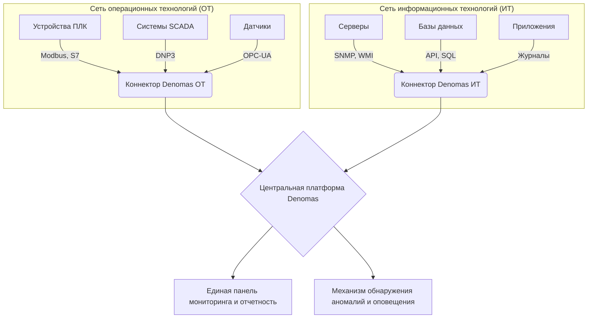

### Введение: Неизбежное пересечение миров ИТ и ОТ

С революцией Индустрии 4.0 два ранее полностью изолированных мира теперь тесно переплетены: информационные технологии (ИТ) и операционные технологии (ОТ). Сети ОТ, управляющие критически важными операциями, такими как автоматизация производства, электростанции и инфраструктура умных городов, подключаются к системам ИТ для достижения таких целей, как анализ данных, удаленное управление и повышение эффективности. Однако это слияние сопряжено с огромной проблемой: как мы можем эффективно отслеживать и управлять этими двумя разными мирами? Философии мониторинга, разработанные для ИТ, часто вступают в конфликт с уникальной и чувствительной природой ОТ.

### Часть 1: 5 основных проблем мониторинга в промышленных (ОТ) сетях

Мониторинг сред ОТ коренным образом отличается от мониторинга веб-сервера. Основные проблемы включают:

1.  **Разнообразные и проприетарные протоколы:** В то время как мир ИТ опирается на стандартизированные протоколы, такие как SNMP и WMI, сфера ОТ заполнена десятками различных, часто проприетарных и закрытых протоколов, таких как Modbus, DNP3, Profinet и S7. Традиционные инструменты мониторинга не могут «говорить» на этих языках.

2.  **Чувствительные и устаревшие системы (Legacy Systems):** Многие ПЛК (программируемые логические контроллеры) или УСПД (устройства сбора и передачи данных) — это устройства, которые работают в полевых условиях десятилетиями, имеют низкую вычислительную мощность и лишены современных исправлений безопасности. Установка «агента» мониторинга на эти системы невозможна, и даже агрессивное сканирование сети (сканирование портов) может привести к сбою или отказу этих устройств.

3.  **Чрезвычайно большой объем данных и требования реального времени:** Представьте себе данные, поступающие с тысяч датчиков на производственной линии за миллисекунды. Эти данные необходимо собирать и обрабатывать мгновенно, а любая нештатная ситуация должна быть обнаружена в течение нескольких секунд. Интервалы опроса традиционных инструментов ИТ-мониторинга недостаточны для такой скорости.

4.  **Безопасность и сетевая изоляция:** Из-за высоких требований к безопасности сети ОТ часто являются «воздушно-изолированными» (физически изолированными от Интернета) или работают за очень строгими правилами межсетевого экрана. Это создает серьезное препятствие для сбора данных мониторинга в центральной системе.

5.  **Разрозненные и необъединенные инструменты:** Часто каждая машина или система (например, от Siemens, Honeywell, Schneider Electric) поставляется с собственным программным обеспечением для мониторинга. Это означает, что в диспетчерской необходимо отслеживать десятки различных экранов, что делает невозможным получение целостного операционного представления.

### Часть 2: Почему традиционные инструменты ИТ-мониторинга не справляются?

Популярные на рынке инструменты ИТ-мониторинга часто оказываются неэффективными перед лицом этих проблем:

*   **ИТ-ориентированные решения, такие как Zabbix, Nagios, PRTG:** Эти инструменты отлично подходят для мониторинга серверов и сетевых устройств. Однако их основная конструкция основана на протоколах ИТ. Мониторинг устройства Modbus часто требует сложных и хрупких решений на основе «пользовательских скриптов». Их агентные подходы и методы активного сканирования представляют прямой риск для чувствительных устройств ОТ.

*   **Гиганты общего назначения, такие как Solarwinds, Microfocus:** Хотя эти платформы предлагают обширные наборы функций, они часто громоздки, имеют высокую стоимость лицензирования и являются «слишком общими» для нишевых требований ОТ. Поддержка даже одного промышленного протокола может потребовать недель профессиональных услуг и настройки. Это непрактично для промышленных сред, которые должны быть быстрыми и гибкими.

### Часть 3: Подход Denomas: единая платформа, разработанная для ОТ

Denomas был разработан именно для того, чтобы заполнить этот пробел. Он предлагает следующие решения для каждой проблемы, с которой не справляются традиционные инструменты:

*   **Гибкость протоколов:** Denomas имеет встроенные коннекторы, которые понимают промышленные протоколы. Даже для неизвестного или пользовательского протокола он может быстро осмыслить любой входящий поток данных благодаря гибким пользовательским парсерам.

*   **Безагентный и пассивный аудит:** Наша платформа никогда не устанавливает «агента» в сетях ОТ. Вместо этого она собирает информацию, пассивно прослушивая сетевой трафик (через сетевые отводы/портыSPAN) или общаясь с устройствами на их собственном языке с помощью безопасных команд только для чтения. Это обеспечивает стабильность и безопасность чувствительных систем.

*   **Высокопроизводительный механизм обработки данных:** Ядро Denomas оптимизировано для эффективной обработки временных рядов данных и больших объемов журналов. Это позволяет ему выполнять обнаружение аномалий в реальном времени, обрабатывая миллионы точек данных за секунды, и хранить данные для долгосрочного анализа тенденций.

*   **Единое представление ИТ/ОТ:** Denomas объединяет данные, собранные из изолированных сетей ОТ, с данными из ИТ-инфраструктуры (серверы, базы данных, приложения) на единой центральной платформе. Это позволяет вам мгновенно увидеть, например, что сбой на производственной линии был вызван определенной службой на определенном сервере.

### Заключение: Сила понимания, а не просто мониторинга

В заключение, мониторинг промышленных систем — это гораздо больше, чем просто проверка их состояния «включено» или «выключено». Успех заключается в том, чтобы извлечь операционный «смысл», объединив данные из тысяч различных источников и установив взаимосвязь между ними. Традиционные инструменты ИТ могут успешно справляться со сбором данных, но они упускают контекст и смысл. Denomas, говоря на языке мира ОТ, превращает данные в информацию, а информацию — в действенные идеи. Это не просто инструмент мониторинга; это платформа оперативной разведки.

---

## Связанные проекты

Узнайте, как Denomas решает конкретные проблемы в этих областях:

*   **[Программное обеспечение для автоматизации управления аудитом Denomas](/project/denomas-avtomatizatsiya-audita/)**: Узнайте, как мы автоматизируем аудит соответствия и конфигурации в различных средах ИТ/ОТ.
*   **[Платформа автоматизации управления Denomas](/project/denomas-avtomatizatsiya-upravleniya/)**: Узнайте о нашей интегрированной платформе для управления инфраструктурой, CI/CD и автоматизации SDLC.
*   **[Программное обеспечение для автоматизации безопасности Denomas](/project/denomas-avtomatizatsiya-bezopasnosti/)**: Посмотрите, как мы повышаем уровень безопасности, автоматизируя соответствие международным стандартам безопасности.
