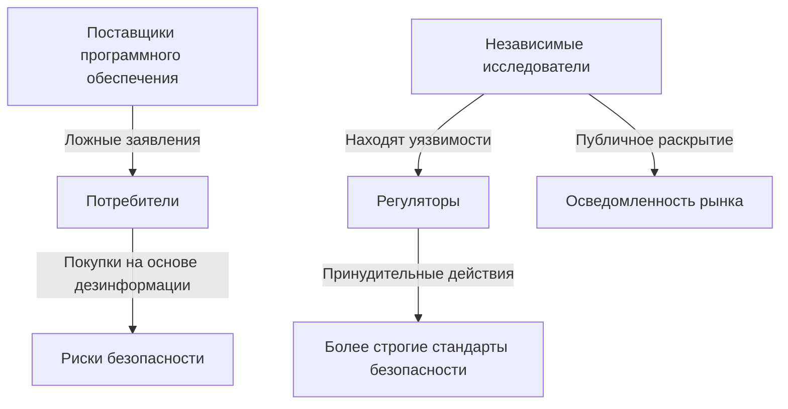

## Введение: Невидимая рука, формирующая подотчетность программного обеспечения

В эпоху, когда доминируют программные платформы и цифровые системы, обеспечение их подотчетности имеет первостепенное значение. Хотя большое внимание уделяется нормативно-правовой базе, меньше внимания уделяется механизмам, которые действительно позволяют таким агентствам, как Федеральная торговая комиссия (FTC), эффективно контролировать свойства безопасности и конфиденциальности информационных технологий. В этой статье утверждается, что независимые исследования, включая обнаружение уязвимостей и обратную разработку, являются не просто дополнением, а решающей, часто невидимой силой в формировании государственного регулирования.

## Незаменимая роль независимых исследований

Независимые исследователи безопасности, журналисты-расследователи, ученые и правозащитные организации выступают в качестве жизненно важных сторожевых псов. Они выявляют уязвимости, нарушения конфиденциальности и обманные практики, которые в противном случае могли бы остаться скрытыми. Их выводы часто служат первоначальным толчком для принудительных действий, укрепляя регулирующие усилия и повышая осведомленность общественности о рисках программного обеспечения.

### Тематические исследования: Независимые исследования как катализатор регулирования

Несколько громких действий FTC подчеркивают прямое влияние независимых исследований:

*   **Урегулирование Zoom (2021):** Независимые исследователи разоблачили ложные заявления Zoom о «сквозном шифровании», что привело к знаковому урегулированию FTC, которое предписало значительные улучшения безопасности.
*   **Дело о неправомерном использовании данных Twitter (2022):** Журналисты и исследователи выявили неправомерное использование Twitter телефонных номеров, собранных для двухфакторной аутентификации (2FA), для целевой рекламы. Это открытие привело к штрафу FTC в размере 150 миллионов долларов, подчеркнув силу враждебных исследований в выявлении обманных практик.
*   **Нарушение Google COPPA (2019):** Защитники конфиденциальности и независимые исследователи обнаружили, что YouTube собирал данные о детях до 13 лет без согласия родителей, что привело к штрафу FTC в размере 170 миллионов долларов и новым мерам по соблюдению требований.

Эти случаи не являются единичными инцидентами, а иллюстрируют закономерность, когда независимый контроль предоставляет правительствам критически важную информацию, необходимую для эффективного правоприменения.

## Реальное воздействие: Выявление системных сбоев

Рассмотрим случай студента университета, который, переехав в новый город, стал получать нежелательные маркетинговые звонки. В результате тщательного расследования студент обнаружил значительную уязвимость безопасности в муниципальных системах, которая непреднамеренно раскрыла данные граждан несанкционированному доступу. Несмотря на ответственное раскрытие информации, чиновники изначально отклонили выводы, спросив: «Зачем вы вообще этим занимаетесь?» Этот инцидент подчеркивает системную проблему: отсутствие структурированных рекомендаций по обработке раскрытия информации о безопасности от независимых исследователей. Без надлежащего регулирования возможности для улучшения безопасности на низовом уровне часто упускаются.

## Экономические и правовые обоснования защиты независимых исследований

Независимые исследования часто сталкиваются с юридическими проблемами в соответствии с такими законами, как Закон об авторском праве в цифровую эпоху (DMCA) и Закон о компьютерном мошенничестве и злоупотреблениях (CFAA). Однако сильные экономические и правовые теории поддерживают их защиту:

### Экономическая теория: Коррекция рыночной асимметрии

Рынки программного обеспечения страдают от информационной асимметрии; потребителям трудно оценивать заявления о безопасности и конфиденциальности. Независимые исследования выступают в качестве корректирующей силы, обеспечивая прозрачность, которую рынок часто не может генерировать органически.

### Правовая теория: Первая поправка и право на расследование

Исследования и журналистские расследования по вопросам безопасности подпадают под защиту свободы слова Первой поправки. Суды все чаще признают исследования безопасности формой научного исследования, которое должно быть юридически защищено, а не криминализировано.

## Политические меры: Укрепление исследовательской экосистемы

Учитывая ее ключевую роль, политики должны активно защищать и поощрять независимые исследования. Мы предлагаем несколько мер:

1.  **Усиление правовой защиты:** Внесите поправки в DMCA и CFAA, чтобы включить явные исключения для добросовестных исследований безопасности, и внедрите положения о «безопасной гавани».
2.  **Создание государственно-частных рамок отчетности:** Обязайте государственные учреждения принимать раскрытие информации об уязвимостях и создавать общедоступные базы данных.
3.  **Предоставление финансирования исследований:** Создайте государственные гранты для независимых исследований безопасности и поощряйте институциональную поддержку.
4.  **Требование прозрачности:** Обеспечьте четкие требования к маркировке функций безопасности/конфиденциальности программного обеспечения и обяжите проводить независимые аудиты для крупных платформ.

## Заключение: Общественное благо для безопасного цифрового будущего

Независимые исследования безопасности являются критически важным общественным благом, которое обеспечивает подотчетность программного обеспечения и способствует соблюдению нормативных требований. Несмотря на юридические и финансовые препятствия, эти исследователи незаменимы. Политики должны признавать и защищать их работу, гарантируя, что те, кто выявляет риски безопасности и конфиденциальности, могут продолжать вносить свой вклад в более безопасную и прозрачную цифровую экосистему для всех.
