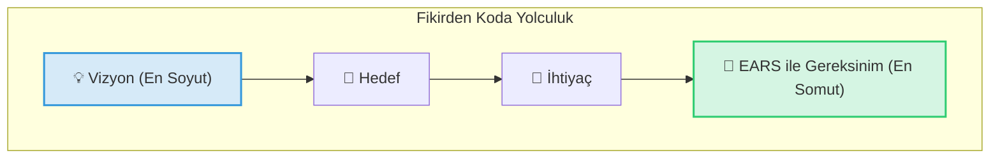

[Seviye: Temel]

Bir projenin yolculuğu, genellikle büyük ve soyut bir hayalle başlar. Ancak bu hayali bir yapay zeka agent'inin anlayabileceği ve koda dökebileceği küçük, somut komutlara (prompt'lara) dönüştürmek gerekir. Bu bölümde, bu yolculuğun adımlarını "Akıllı Kahve Makinesi" örneğimiz üzerinden inceleyeceğiz.

### 3.1. Fikirden Koda Yolculuk Hiyerarşisi

Bu süreci, tepesi en soyut, tabanı ise en somut olan bir piramit gibi düşünebiliriz:

### 3.2. Hiyerarşinin Zirvesi: Vizyon

Her şey en tepedeki büyük hayal ile başlar. Vizyon, projenin nihai varoluş sebebidir.

- **Vizyon:** "İnsanların sabahları mükemmel kahveyle güne başlamasını sağlayan, dünyanın en akıllı ve en kolay kullanımlı kahve makinesini yaratmak."

Bu harika bir başlangıçtır, ama bir mühendise ne yapacağını söylemez.

### 3.3. Bir Alt Adım: Hedefler

Vizyonu daha somut, ulaşılabilir amaçlara böleriz.

- **Hedef 1:** "Kullanıcıların telefonlarından kahve demlemeyi başlatabilmesini sağlamak."
- **Hedef 2:** "Makinenin, su veya çekirdek bittiğinde kullanıcıyı uyarmasını sağlamak."

Hedefler, bize "nereye" gideceğimizi söyler, ama hala "nasıl" gideceğimizi tam olarak anlatmaz.

### 3.4. Hedeflerden Doğan: İhtiyaçlar

Her hedefin gerçekleşmesi için karşılanması gereken ihtiyaçlar vardır.

- **İhtiyaç (Hedef 1 için):** "Makine ile telefon arasında bir kablosuz bağlantıya (Bluetooth veya Wi-Fi) ihtiyaç var."
- **İhtiyaç (Hedef 2 için):** "Su seviyesini ve çekirdek seviyesini ölçebilen sensörlere ihtiyaç var."

Artık donanımsal ve yazılımsal olarak nelerin gerekli olduğunu görmeye başlıyoruz. Ama hala bir AI agent'in kod yazması için yeterince net değiliz.

### 3.5. Hiyerarşinin Temeli: EARS ile Gereksinimler

İşte EARS'ın parladığı yer burasıdır. İhtiyaçları, hiçbir yoruma yer bırakmayacak şekilde, test edilebilir ve atomik gereksinimlere dönüştürürüz.

- **Gereksinim (İhtiyaç 1 için):** "Kullanıcı mobil uygulamadaki 'demle' düğmesine bastığında, Akıllı Kahve Makinesi, demleme işlemini başlatacaktır."
- **Gereksinim (İhtiyaç 2 için):** "Eğer su seviyesi minimumun altına düşerse, o zaman Akıllı Kahve Makinesi, mobil uygulamaya 'su seviyesi düşük' bildirimi gönderecektir."

Gördüğünüz gibi, büyük bir vizyondan yola çıkarak, bir AI agent'in anlayıp uygulayabileceği son derece net ve küçük bir komuta ulaştık. Bu kitap boyunca, bu hiyerarşiyi kurma ve en temel katman olan gereksinimleri kusursuzca yazma sanatında ustalaşacağız.

{}
**Bu Bölümden Akılda Kalanlar**

- Projeler; Vizyon, Hedef, İhtiyaç ve Gereksinim katmanlarından oluşur.
- EARS, en alt ve en somut katman olan "Gereksinim" katmanında çalışır.
- Soyut bir vizyonu, AI agent'lerin anlayabileceği somut gereksinimlere dönüştürmek, başarılı bir projenin anahtarıdır.
  {}

{}
**Sıra Sizde! (Düşünce Egzersizi)**

Kendi küçük projenizi hayal edin (örneğin "akıllı bir sulama sistemi"). Bu projenin Vizyonunu, bir Hedefini, o hedefe yönelik bir İhtiyacını ve son olarak o ihtiyacı karşılayan bir EARS Gereksinimini yazmayı deneyin.
{}
