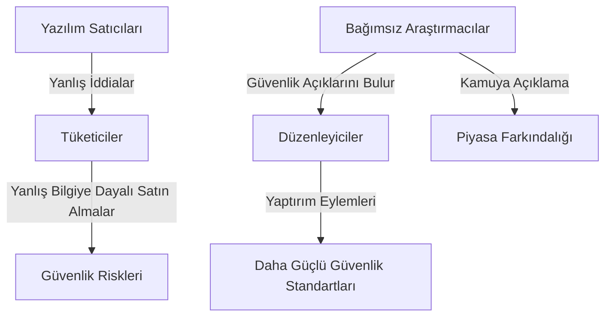

## Giriş: Yazılım Hesap Verebilirliğini Şekillendiren Görünmez El

Yazılım platformları ve dijital sistemlerin egemen olduğu bir çağda, bunların hesap verebilirliğini sağlamak büyük önem taşımaktadır. Düzenleyici çerçevelere çok dikkat edilse de, Federal Ticaret Komisyonu (FTC) gibi kurumların bilgi teknolojilerinin güvenlik ve gizlilik özelliklerini etkin bir şekilde denetlemesini sağlayan mekanizmalara daha az dikkat edilmektedir. Bu makale, güvenlik açığı tespiti ve tersine mühendislik dahil olmak üzere bağımsız araştırmanın, devlet regülasyonlarını şekillendirmede sadece tamamlayıcı değil, aynı zamanda kritik, çoğu zaman görünmez bir güç olduğunu savunmaktadır.

## Bağımsız Araştırmanın Vazgeçilmez Rolü

Bağımsız güvenlik araştırmacıları, araştırmacı gazeteciler, akademisyenler ve savunuculuk kuruluşları, hayati birer bekçi köpeği görevi görürler. Aksi takdirde gizli kalabilecek güvenlik açıklarını, gizlilik ihlallerini ve aldatıcı uygulamaları ortaya çıkarırlar. Bulguları genellikle yaptırım eylemleri için ilk tetikleyici görevi görür, düzenleyici çabaları güçlendirir ve yazılım riskleri hakkında kamuoyunun farkındalığını artırır.

### Vaka Çalışmaları: Düzenleyici Bir Katalizör Olarak Bağımsız Araştırma

Birkaç yüksek profilli FTC eylemi, bağımsız araştırmanın doğrudan etkisini vurgulamaktadır:

*   **Zoom Anlaşması (2021):** Bağımsız araştırmacılar, Zoom'un "uçtan uca şifreleme" iddialarının yanlış olduğunu ortaya çıkardı ve bu, önemli güvenlik iyileştirmeleri gerektiren dönüm noktası niteliğinde bir FTC anlaşmasına yol açtı.
*   **Twitter Veri Kötüye Kullanımı Davası (2022):** Gazeteciler ve araştırmacılar, Twitter'ın iki faktörlü kimlik doğrulama (2FA) için toplanan telefon numaralarını hedefli reklamcılık için kötüye kullandığını ortaya çıkardı. Bu keşif, aldatıcı uygulamaları ortaya çıkarmada düşmanca araştırmanın gücünü vurgulayan 150 milyon dolarlık bir FTC para cezasıyla sonuçlandı.
*   **Google'ın COPPA İhlali (2019):** Gizlilik savunucuları ve bağımsız araştırmacılar, YouTube'un 13 yaşın altındaki çocuklardan ebeveyn izni olmadan veri topladığını tespit etti ve bu, 170 milyon dolarlık bir FTC para cezasına ve yeni uyumluluk önlemlerine yol açtı.

Bu vakalar, bağımsız denetimin hükümetlere etkin yaptırım için gerekli kritik istihbaratı sağladığı bir modelin örnekleridir.

## Gerçek Dünya Etkisi: Sistematik Başarısızlıkları Ortaya Çıkarmak

Yeni bir şehre taşındıktan sonra istenmeyen pazarlama aramaları alan bir üniversite öğrencisinin durumunu düşünün. Öğrenci, titiz bir araştırma sonucunda, belediye sistemlerinde vatandaş verilerini yetkisiz erişime maruz bırakan önemli bir güvenlik açığı keşfetti. Sorumlu bir şekilde ifşa etmesine rağmen, yetkililer başlangıçta bulguları reddederek, "Neden buna bakıyorsunuz ki?" diye sordular. Bu olay, bağımsız araştırmacılardan gelen güvenlik ifşalarını ele almak için yapılandırılmış yönergelerin eksikliği gibi sistematik bir sorunu vurgulamaktadır. Uygun düzenlemeler olmadan, taban düzeyinde güvenliği iyileştirme fırsatları genellikle kaçırılır.

## Bağımsız Araştırmayı Korumak İçin Ekonomik ve Hukuki Gerekçeler

Bağımsız araştırmalar, Dijital Binyıl Telif Hakkı Yasası (DMCA) ve Bilgisayar Dolandırıcılığı ve Kötüye Kullanım Yasası (CFAA) gibi yasalar kapsamında genellikle yasal zorluklarla karşılaşmıştır. Ancak, güçlü ekonomik ve hukuki teoriler bu araştırmanın korunmasını desteklemektedir:

### Ekonomik Teori: Piyasa Asimetrisini Düzeltme

Yazılım piyasaları bilgi asimetrisinden muzdariptir; tüketiciler güvenlik ve gizlilik iddialarını değerlendirmekte zorlanırlar. Bağımsız araştırmalar, piyasanın organik olarak üretemediği şeffaflığı sağlayarak düzeltici bir güç görevi görür.

### Hukuki Teori: İlk Keşif ve Araştırma Hakkı

Güvenlik konularındaki araştırma ve araştırmacı gazetecilik, Birinci Keşif'in ifade özgürlüğü koruması kapsamına girer. Mahkemeler, güvenlik araştırmasını giderek bir bilimsel araştırma biçimi olarak tanımaktadır ve bu, suç sayılmak yerine yasal olarak korunmalıdır.

## Politika Müdahaleleri: Araştırma Ekosistemini Güçlendirme

Kritik rolü göz önüne alındığında, politika yapıcılar bağımsız araştırmayı aktif olarak korumalı ve teşvik etmelidir. Birkaç müdahale öneriyorum:

1.  **Yasal Korumaları Güçlendirme:** DMCA ve CFAA'yı iyi niyetli güvenlik araştırmaları için açık muafiyetler içerecek şekilde değiştirme örnekleri incelenerek siber güvenlik kanunları ve bilgi güvenliği ile ilgili mevzuatlarda ve "güvenli liman" hükümleri uygulanmalıdır.
2.  **Kamu-Özel Raporlama Çerçeveleri Oluşturma:** Devlet kurumlarının güvenlik açığı ifşalarını kabul etmesini ve kamuya açık veritabanları oluşturması zorunlu kılınmalıdır.
3.  **Araştırma Fonu Sağlama:** Bağımsız güvenlik araştırmaları için devlet destekli hibeler oluşturulmalı ve kurumsal desteği teşvik edilmelidir.
4.  **Şeffaflık Gereksinimi:** Yazılım güvenlik/gizlilik özellikleri için açık etiketleme gereksinimlerini uygulayıp ve büyük platformlar için bağımsız denetimler zorunlu kılınmalıdır.

## Sonuç: Güvenli Bir Dijital Gelecek İçin Bir Kamu Malı

Bağımsız güvenlik araştırması, yazılımın hesap verebilirliğini sağlayan ve düzenleyici uygulamaları yönlendiren kritik bir kamu hizmetidir. Yasal ve mali engellerle karşılaşmasına rağmen, bu araştırmacılar vazgeçilmezdir. Politika yapıcılar, _güvenlik ve gizlilik risklerini ortaya çıkaranların_ herkes için daha güvenli ve şeffaf bir dijital ekosisteme katkıda bulunmaya devam edebilmelerini sağlayacak çalışmalarını tanımalı ve korumalıdır.
