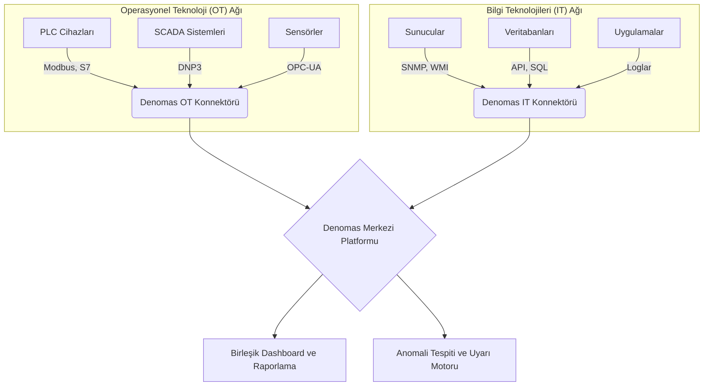

### Giriş: IT ve OT Dünyalarının Kaçınılmaz Kesişimi

Endüstri 4.0 devrimiyle birlikte, daha önce birbirinden tamamen izole olan iki dünya artık iç içe geçmiş durumda: Bilgi Teknolojileri (IT) ve Operasyonel Teknolojiler (OT). Fabrika otomasyon sistemleri, enerji santralleri ve akıllı şehir altyapıları gibi kritik operasyonları yöneten OT ağları, veri analitiği, uzaktan yönetim ve verimlilik artışı gibi hedeflerle IT sistemlerine bağlanıyor. Ancak bu birleşme, beraberinde devasa bir zorluk getiriyor: Bu iki farklı dünyayı nasıl etkin bir şekilde izleyebilir ve yönetebiliriz? IT için tasarlanmış izleme felsefeleri, OT'nin kendine özgü ve hassas doğasıyla çoğu zaman çatışır.

### Bölüm 1: Endüstriyel (OT) İzlemenin 5 Temel Zorluğu

OT ortamlarını izlemek, bir web sunucusunu izlemekten temelden farklıdır. Karşılaşılan temel zorluklar şunlardır:

1.  **Farklı ve Kapalı Protokoller:** IT dünyası SNMP, WMI gibi standartlaşmış protokollere dayanırken, OT sahası Modbus, DNP3, Profinet, S7 gibi onlarca farklı, genellikle üreticiye özel ve kapalı protokollerle doludur. Geleneksel izleme araçları bu dilleri "konuşamaz".

2.  **Hassas ve Eski Sistemler (Legacy Systems):** Birçok PLC (Programlanabilir Mantıksal Denetleyici) veya RTU (Uzak Terminal Ünitesi), on yıllardır sahada çalışan, düşük işlem gücüne sahip ve modern güvenlik yamalarından yoksun cihazlardır. Bu sistemlere bir izleme "ajanı" kurmak imkansız olduğu gibi, agresif bir ağ taraması (port scanning) bile bu cihazların kilitlenmesine veya arızalanmasına neden olabilir.

3.  **Aşırı Yüksek Veri Hacmi ve Gerçek Zamanlılık:** Bir üretim bandındaki binlerce sensörden milisaniyeler içinde akan veriyi düşünün. Bu verinin anlık olarak toplanması, işlenmesi ve anormal bir durumun saniyeler içinde tespit edilmesi gerekir. Geleneksel IT izleme araçlarının yoklama (polling) aralıkları bu hız için yetersiz kalır.

4.  **Güvenlik ve Ağ İzolasyonu:** Yüksek güvenlik gereksinimi nedeniyle OT ağları genellikle "air-gapped" (fiziksel olarak internetten izole) veya çok katmanlı güvenlik duvarları arkasında çalışır. Bu durum, izleme verilerini merkezi bir sisteme toplamanın önünde ciddi bir engel teşkil eder.

5.  **Birleşik Olmayan Araçlar:** Genellikle her makine veya sistem (örneğin, Siemens, Honeywell, Schneider Electric) kendi izleme yazılımıyla gelir. Bu da kontrol odasında onlarca farklı ekranın takip edilmesi ve bütünsel bir operasyonel görünümün elde edilememesi anlamına gelir.

### Bölüm 2: Geleneksel IT İzleme Araçları Neden Yetersiz Kalıyor?

Pazardaki popüler IT izleme araçları, bu zorluklar karşısında genellikle etkisiz kalır:

*   **Zabbix, Nagios, PRTG gibi IT-Odaklı Çözümler:** Bu araçlar, sunucuları ve ağ cihazlarını izlemek için mükemmeldir. Ancak temel tasarımları IT protokollerine dayanır. Bir Modbus cihazını izlemek için genellikle karmaşık ve kırılgan "custom script" çözümlerine ihtiyaç duyarlar. Ajan tabanlı yaklaşımları ve aktif tarama yöntemleri, hassas OT cihazları için doğrudan bir risk oluşturur.

*   **Solarwinds, Microfocus gibi Genel Amaçlı Devler:** Bu platformlar, geniş özellik setleri sunsa da, genellikle hantal, lisanslama maliyetleri yüksek ve OT'nin niş gereksinimleri için "fazla genel" kalırlar. Tek bir endüstriyel protokolü desteklemek için bile haftalar süren profesyonel hizmet ve yapılandırma gerektirebilirler. Bu durum, hızlı ve esnek olması gereken endüstriyel ortamlar için pratik değildir.

### Bölüm 3: Denomas'ın Yaklaşımı: OT İçin Tasarlanmış Birleşik Bir Platform

Denomas, tam da bu boşluğu doldurmak için tasarlandı. Geleneksel araçların yetersiz kaldığı her bir zorluğa şu çözümleri getirir:

*   **Protokol Esnekliği:** Denomas, endüstriyel protokolleri yerel (native) olarak anlayan konektörlere sahiptir. Bilinmeyen veya özel bir protokol için bile, esnek veri ayrıştırıcıları (custom parsers) sayesinde gelen herhangi bir veri akışını hızla anlamlandırabilir.

*   **Ajansız ve Pasif Denetim:** Platformumuz, OT ağlarına asla bir "ajan" kurmaz. Bunun yerine, ağ trafiğini pasif olarak dinleyerek (network tap/span portları üzerinden) veya cihazlarla kendi dillerinde, güvenli ve salt okunur komutlarla konuşarak bilgi toplar. Bu, hassas sistemlerin kararlılığını ve güvenliğini garanti altına alır.

*   **Yüksek Performanslı Veri İşleme Motoru:** Denomas'ın çekirdeği, zaman serisi verilerini (time-series data) ve yüksek hacimli logları verimli bir şekilde işlemek için optimize edilmiştir. Bu sayede, milyonlarca veri noktasını saniyeler içinde işleyerek hem anlık anomali tespiti yapabilir hem de yıllarca geriye dönük trend analizleri için verileri saklayabilir.

*   **Birleşik IT/OT Görünümü:** Denomas, izole OT ağlarından topladığı verileri, IT altyapısından (sunucular, veritabanları, uygulamalar) gelen verilerle tek bir merkezi platformda birleştirir. Bu, bir üretim hattındaki bir arızanın, hangi sunucudaki hangi servis tarafından tetiklendiğini anında görmenizi sağlar.

### Sonuç: Sadece İzlemenin Değil, Anlamanın Gücü

Sonuç olarak, endüstriyel sistemleri izlemek, sadece "çalışıyor" veya "çalışmıyor" (up/down) durumunu kontrol etmekten çok daha fazlasıdır. Başarı, binlerce farklı kaynaktan gelen veriyi bir araya getirip, aralarındaki ilişkiyi kurarak operasyonel bir "anlam" çıkarmaktan geçer. Geleneksel IT araçları veri toplama konusunda başarılı olabilir, ancak bağlamı ve anlamı kaçırırlar. Denomas ise, OT dünyasının dilini konuşarak, veriyi bilgiye, bilgiyi ise eyleme geçirilebilir öngörülere dönüştürür. Bu, sadece bir izleme aracı değil, bir operasyonel zeka platformudur.

---

## İlgili Projeler

Denomas'ın bu alanlardaki spesifik zorlukları nasıl ele aldığını keşfedin:

*   **[Denomas Denetim Bilgi Yönetimi Otomasyon Yazılımı](/project/denomas-denetim-otomasyonu/)**: Çeşitli IT/OT ortamlarında uyumluluk ve yapılandırma denetimini nasıl otomatikleştirdiğimizi keşfedin.
*   **[Denomas Yönetim Otomasyon Platformu](/project/denomas-yonetim-otomasyonu/)**: Altyapı yönetimi, CI/CD ve SDLC otomasyonu için entegre platformumuzu öğrenin.
*   **[Denomas Güvenlik Otomasyon Yazılımı](/project/denomas-guvenlik-otomasyonu/)**: Uluslararası güvenlik standartlarına uyumu otomatikleştirmek suretiyle güvenlik duruşunu nasıl güçlendirdiğimizi görün.
