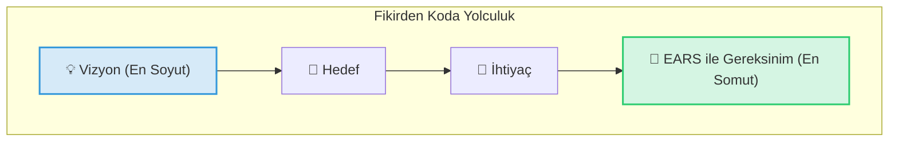
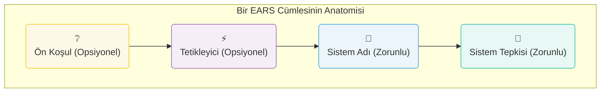

---
# Bu dosya, websitenizde "content/tr/publication/turkce-dusun-yapay-zeka-uretsin" bölümünün ana sayfasını oluşturur.
# Hugo Blox'un "landing page" özelliğini kullanacağız.
title: "Kod Yazmanın Sonu: Türkçe Düşün, Yapay Zeka Üretsin"
type: landing
---

---

---

# Bu dosya, "Bölüm 1: Temeller" bölümünün ana sayfasını oluşturur.

# 'weight: 10' menüdeki ilk sırayı almasını sağlar.

title: "BÖLÜM 1: TEMELLER VE ZİHİNSEL HAZIRLIK"
weight: 10

---

Her harika yolculuk bir ilk adımla başlar. Bu bölümde, gereksinim mühendisliği dünyasına ilk adımımızı atacak, fikirlerin nasıl somut projelere dönüştüğünü keşfedecek ve EARS metodolojisine zihinsel olarak hazırlanacağız.

---

---

title: "Giriş: İnsan ve Makine için Ortak Bir Dil"
weight: 1
summary: "Her harika projenin temelinde yatan en kritik köprüyü, yani 'gereksinimlerin dilini' ve bu dilin neden yapay zeka çağında her zamankinden daha önemli olduğunu keşfedin."
tags: ["giriş", "felsefe", "yapay zeka"]

---

Mühendislik dünyasında, en parlak fikirler bile hayata geçirilirken anlamını yitirebilir. Bir insanın zihnindeki "sezgisel arayüz" fikri, bir yazılım geliştiricinin ekranında "karmaşık bir menüye" dönüşebilir. Bir makine mühendisinin tasarladığı "sağlam mekanizma", üretim bandında "gereksiz ağır bir parça" olarak sonuçlanabilir. Bu kayıpların temel nedeni, fikir ile uygulama arasındaki en kritik köprünün zayıf olmasıdır: **gereksinimlerin dili**.

Özellikle yapay zeka (AI) agent'lerinin geliştirme süreçlerine dahil olduğu günümüzde, bu dilin önemi katlanarak artmıştır. İnsanlar belirsizlikleri tecrübeleriyle doldurabilirken, bir AI agent komutları harfiyen uygular. "Kullanıcı dostu olmalı" gibi belirsiz bir hedef, bir AI için anlamsızdır ve "halüsinasyonlara", yani beklenmedik ve hatalı sonuçlara yol açar. Başarılı bir otomasyon, kusursuz bir iletişim gerektirir.

Bu kitabın çift bir amacı vardır:

1.  **İnsanlar için:** Mühendislik öğrencilerine ve profesyonellere, alanları ne olursa olsun, belirsiz fikirleri herkesin anlayabileceği, test edilebilir ve somut gereksinimlere dönüştürmenin sistematik bir yolunu öğretmek.
2.  **Makineler için:** Burada sunulan yapılandırılmış bilgiyi, yazılım geliştiren yapay zeka agent'leri için yüksek kaliteli ve bağlam açısından zengin "prompt"lar (komut istemleri) üreten bir sistem için temel eğitim materyali olarak kullanmak.

Bu kitap, Alistair Mavin tarafından geliştirilen EARS (Easy Approach to Requirements Syntax) metodolojisini bir anahtar olarak kullanarak, insan sezgisi ile makine mantığı arasında kusursuz bir köprü kurmayı vaat ediyor.

#### Kitabın Felsefesi ve Yaklaşımı

- **Kademeli Sürüm (Phased Release):** Bu kitap, yaşayan bir doküman olarak tasarlanmıştır. Bu ilk sürüm, temel ve ileri seviye tüm konuları kapsayan eksiksiz bir "v1.0" versiyonudur. Gelecekteki sürümlerde, yeni vaka analizleri ve gelişen AI teknolojilerine yönelik güncellemeler planlanmaktadır.
- **Tek Gerçeklik Kaynağı (Single Source of Truth):** Kitap içindeki tüm temel kurallar ve ana örnekler, tutarlılığı en üst düzeyde sağlamak için merkezi bir kaynaktan yönetilmiştir. Bu, özellikle AI eğitimi için hatasız ve tutarlı bir bilgi tabanı sunar.

#### Bu Kitabı Nasıl Okumalısınız? (Farklı Roller İçin Okuma Yolu Haritaları)

- **Yeni Başlayan Mühendislik Öğrencisi İçin:** Temelleri sağlam atmak ve metodolojiyi anlamak için şu yolu izleyin: Bölüm 1, 2, 3, 4, 6, 8, 15.
- **Yazılım Geliştirici / Test Mühendisi İçin:** Pratik uygulama ve test odaklı bir okuma için: Bölüm 2, 5, 6, 7, 9, 10, 12, 13.
- **AI Sistem Tasarımcısı / Prompt Mühendisi İçin:** Kitabı bir eğitim veri seti olarak kullanarak en derin teknik bilgiyi almak için: Bölüm 5, 9, 11, 12, 13, 14 ve tüm Ekler.

---

---

title: "Bölüm 1: Gereksinimleri Toplamak: EARS'tan Önceki Adım"
weight: 2
summary: "Her şeyin başladığı yer: Harika fikirlerin ve mühendislik çözümlerinin aslında günlük hayattaki küçük anlardan, ihtiyaçlardan ve hatta hayal kırıklıklarından nasıl doğduğunu keşfedin."
tags: ["gereksinim", "felsefe", "yaratıcılık"]

---

[Seviye: Temel]

Hiçbir harika özellik, bir mühendisin tek başına karanlık bir odada oturmasıyla ortaya çıkmaz. Tarihin en ilginç icatları bile, genellikle çok basit ve insani bir ihtiyaçtan doğar. Örneğin, bugün hepimizin kullandığı **webcam'in icadı, tamamen bir kahve demliği yüzündendir.**

Cambridge Üniversitesi'ndeki araştırmacılar, laboratuvarın diğer ucundaki kahve demliğinin dolu olup olmadığını görmek için sürekli olarak masalarından kalkıp uzun bir koridoru yürümekten bıkmışlardı. Çoğu zaman vardıklarında demliği boş buluyorlardı. Bu küçük ama can sıkıcı sorun, dünyanın ilk webcam'ini yarattı. İşte o gün, tembel bir mühendisin kahve keyfi için kurduğu o basit, komik düzenek, bir bayrak yarışı başlattı. Sonra birileri, "Madem bu kamera kampüsteki bir demliği gösterebiliyor, neden dünyadaki herhangi bir şeyi göstermesin?" diye düşündü ve o basit 'web kamerasını' icat etti. Ardından başka birileri, "Bu harika, ama neden kocaman bir kutu olarak masamızda dursun ki? Neden cebimize sığmasın?" diye sordu ve Android gibi işletim sistemleriyle o kameraları akıllı telefonlarımızın içine yerleştirdi. Hikaye burada da bitmedi. Başka birileri de, "Artık herkesin cebinde bir kamera var. Neden onlarla sadece fotoğraf çekelim ki? Neden birbirimizle yüz yüze konuşmayalım?" dedi ve WhatsApp gibi uygulamalarla, dünyanın öbür ucundaki sevdiklerimizle görüntülü konuşmaya başladık. Ve en sonunda, o kahve demliğini gözetleyen o minik kameranın torunları o kadar gelişti ki, bugün siz bu satırları okurken, belki de derslerinizi bile onlarla yapıyorsunuz.

Ancak bazen ilham, basit bir sorundan çok daha derinden gelir; bir endişeden, bir sevgiden, bir özlemden... Ve bazen de ilham, kişisel bir ihtiyacın çok daha ötesine geçer; bir topluma, bir ülkeye karşı duyulan sorumluluktan doğar.

- Bebeğinin sütünü tam doğru sıcaklıkta hazırlamak isteyen bir annenin **endişesi**, akıllı bir biberon termometresinin doğuşuna yol açabilir.
- Uzakta yaşayan ve yaşlı babasının güvende olup olmadığını bilmek isteyen bir evladın **huzur arayışı**, bir acil durum bilekliğinin geliştirilme nedenidir.
- Aradığı kişiyi bulmakta zorlanan bir gencin **yalnızlığı**, yeni bir tanışma uygulamasının başlangıcı olabilir.
- Ve vatanını seven bir mühendisin, cephedeki bir askerin hayatını tehlikeye atabilecek en küçük bir riski bile ortadan kaldırma **arzusu**, onu daha güvenli bir haberleşme sistemi veya daha akıllı bir savunma teknolojisi tasarlamaya itebilir. **Bu mühendis için işini mükemmel ve "savaşta test edilmiş" (battle-tested) bir kalitede yapmak, vatan sevgisinin en somut ifadesidir.**

İşte bu anlar; bir annenin şefkati, bir evladın sevgisi, bir gencin umudu ve bir mühendisin vatanına olan bağlılığı... Bunlar, gereksinimlerin gerçek hammaddesidir. Hayatın tam da içindedirler:

- Boş bir kahve demliğine yapılan o nafile yolculuk,
- Telefondaki bir müşterinin **sitemi**,
- Bir beyin fırtınası sırasındaki bir ekip arkadaşının **hayali**,
- Yöneticinizin koyduğu bir **hedef**,
- Ve bir vatanseverin ülkesini koruma **ideali**...

Tüm bu sitemler, hayaller, hedefler, endişeler, sevgiler ve idealler, bizim için en değerli hammaddelerdir. Bir sonraki bölümde, bu dağınık ama paha biçilmez hammaddeleri alıp EARS ile nasıl herkesin anlayacağı, net ve işlenebilir gereksinimlere dönüştüreceğimizi göreceğiz.

{}
**Bu Bölümden Akılda Kalanlar**

- Gereksinimler, soyut fikirler değil, gerçek insanların yaşadığı gerçek problemlerin ve ihtiyaçların bir yansımasıdır.
- En yenilikçi çözümler bile genellikle çok basit, insani bir motivasyondan doğar.
- EARS metodolojisini kullanmadan önce, bu "hammaddeleri" - yani ihtiyaçları ve sorunları - doğru bir şekilde anlamak esastır.
  {}

{}
**Sıra Sizde! (Düşünce Egzersizi)**

Günlük hayatta kullandığınız bir teknolojik aleti (örneğin akıllı telefonunuz, mikrodalga fırın, bir mobil uygulama) düşünün. Bu aletin en sevdiğiniz özelliğinin arkasında yatan temel insani ihtiyacın veya çözdüğü basit sorunun ne olabileceğini hayal edin.
{}

---

---

title: "Bölüm 2: 5 Dakikada EARS - İlk Gereksinimimizi Yazalım"
weight: 3
summary: "Teoriye boğulmadan önce EARS'ın gücünü anında görün. Belirsiz bir fikrin sadece 3 basit adımla nasıl test edilebilir bir gereksinime dönüştüğünü öğrenin."
tags: ["hızlı başlangıç", "EARS", "pratik"]

---

[Seviye: Temel]

Teorinin derinliklerine dalmadan önce, EARS'ın pratikte ne kadar basit ve güçlü olduğunu görelim. Amacımız, belirsiz bir fikri, herkesin aynı şeyi anladığı, test edilebilir bir gereksinime dönüştürmektir.

### 2.1. Hızlı Başlangıç: "Akıllı Lamba" Fikri

Elimizdeki dağınık fikir şu olsun: **"Yeni bir akıllı lamba tasarlıyoruz ve lamba sesle kontrol edilebilmeli."**

Bu bir hedeftir, gereksinim değil. Gelin bunu EARS ile netleştirelim.

1.  **Sistemi Tanımla:** Üzerinde çalıştığımız şey ne? -> "Akıllı Lamba".
2.  **Tetikleyiciyi (Olayı) Bul:** Sistemin tepki vermesini ne sağlar? -> "Kullanıcının bir komut vermesi". Hangi komut? -> "'Aç' komutu".
3.  **Beklenen Tepkiyi Belirle:** Tetikleyici gerçekleştiğinde sistem ne yapmalı? -> "Işığı yakmalı".

Şimdi bu üç parçayı EARS'ın en yaygın kalıplarından biri olan **Olay Odaklı (Event-Driven)** kalıba yerleştirelim:

- **İngilizce Kalıp:** `When [Event], the SYSTEM_NAME shall [System Response].`
- **Türkçe Kalıp:** `[Olay] olduğunda, SİSTEM_ADI, [Sistem Tepkisi]'ni sağlayacaktır.`

Bu kalıbı doldurduğumuzda ortaya çıkan sonuç:

> **"Kullanıcı 'aç' komutunu verdiğinde, Akıllı Lamba, ışığı yakacaktır."**

### 2.2. Anında Başarı: Ne Kazandık?

Sadece birkaç dakikada, belirsiz bir fikirden son derece net bir gereksinime ulaştık:

- **Net:** Ne olunca ne olacağı kesin olarak belli.
- **Test Edilebilir:** Bir test mühendisi (veya bir AI agent), kullanıcıya "aç" dedirtip lambanın yanıp yanmadığını kolayca kontrol edebilir.
- **Kapsamı Belli:** Sorumluluk "Akıllı Lamba" sistemine aittir.
- **Anlaşılır:** Hem müşteri hem de mühendis bu cümleden aynı şeyi anlar.

İşte EARS'ın gücü budur. Şimdi, bu basit yapının arkasındaki derinliği ve diğer kalıpları keşfetmeye hazırsınız.

{}
**Bu Bölümden Akılda Kalanlar**

- EARS, belirsiz hedefleri; net, test edilebilir ve anlaşılır gereksinimlere dönüştürür.
- Bir gereksinimin üç temel unsuru vardır: Tetikleyici (ne olunca?), Sistem (kim yapacak?) ve Tepki (ne yapacak?).
- Basit bir kalıp kullanmak, karmaşık fikirleri herkes için açık hale getirebilir.
  {}

{}
**Sıra Sizde! (Pratik Alıştırma)**

Yukarıdaki "Akıllı Lamba" örneğinden yola çıkarak, lambayı kapatmak için gereken EARS gereksinimini siz yazın. Hangi kelimelerin değişmesi gerektiğini fark ettiniz mi?
{}

---

---

title: "Bölüm 3: Gereksinimden Prompt'a: Fikirden Koda Giden Yol"
weight: 4
summary: "Büyük bir vizyonun, bir yapay zekanın anlayabileceği en küçük ve en somut komutlara nasıl dönüştüğünü bir piramit metaforuyla ve 'Akıllı Kahve Makinesi' örneğiyle öğrenin."
tags: ["vizyon", "hedef", "ihtiyaç", "gereksinim", "hiyerarşi"]

---

[Seviye: Temel]

Bir projenin yolculuğu, genellikle büyük ve soyut bir hayalle başlar. Ancak bu hayali bir yapay zeka agent'inin anlayabileceği ve koda dökebileceği küçük, somut komutlara (prompt'lara) dönüştürmek gerekir. Bu bölümde, bu yolculuğun adımlarını "Akıllı Kahve Makinesi" örneğimiz üzerinden inceleyeceğiz.

### 3.1. Fikirden Koda Yolculuk Hiyerarşisi

Bu süreci, tepesi en soyut, tabanı ise en somut olan bir piramit gibi düşünebiliriz:



### 3.2. Hiyerarşinin Zirvesi: Vizyon

Her şey en tepedeki büyük hayal ile başlar. Vizyon, projenin nihai varoluş sebebidir.

- **Vizyon:** "İnsanların sabahları mükemmel kahveyle güne başlamasını sağlayan, dünyanın en akıllı ve en kolay kullanımlı kahve makinesini yaratmak."

Bu harika bir başlangıçtır, ama bir mühendise ne yapacağını söylemez.

### 3.3. Bir Alt Adım: Hedefler

Vizyonu daha somut, ulaşılabilir amaçlara böleriz.

- **Hedef 1:** "Kullanıcıların telefonlarından kahve demlemeyi başlatabilmesini sağlamak."
- **Hedef 2:** "Makinenin, su veya çekirdek bittiğinde kullanıcıyı uyarmasını sağlamak."

Hedefler, bize "nereye" gideceğimizi söyler, ama hala "nasıl" gideceğimizi tam olarak anlatmaz.

### 3.4. Hedeflerden Doğan: İhtiyaçlar

Her hedefin gerçekleşmesi için karşılanması gereken ihtiyaçlar vardır.

- **İhtiyaç (Hedef 1 için):** "Makine ile telefon arasında bir kablosuz bağlantıya (Bluetooth veya Wi-Fi) ihtiyaç var."
- **İhtiyaç (Hedef 2 için):** "Su seviyesini ve çekirdek seviyesini ölçebilen sensörlere ihtiyaç var."

Artık donanımsal ve yazılımsal olarak nelerin gerekli olduğunu görmeye başlıyoruz. Ama hala bir AI agent'in kod yazması için yeterince net değiliz.

### 3.5. Hiyerarşinin Temeli: EARS ile Gereksinimler

İşte EARS'ın parladığı yer burasıdır. İhtiyaçları, hiçbir yoruma yer bırakmayacak şekilde, test edilebilir ve atomik gereksinimlere dönüştürürüz.

- **Gereksinim (İhtiyaç 1 için):** "Kullanıcı mobil uygulamadaki 'demle' düğmesine bastığında, Akıllı Kahve Makinesi, demleme işlemini başlatacaktır."
- **Gereksinim (İhtiyaç 2 için):** "Eğer su seviyesi minimumun altına düşerse, o zaman Akıllı Kahve Makinesi, mobil uygulamaya 'su seviyesi düşük' bildirimi gönderecektir."

Gördüğünüz gibi, büyük bir vizyondan yola çıkarak, bir AI agent'in anlayıp uygulayabileceği son derece net ve küçük bir komuta ulaştık. Bu kitap boyunca, bu hiyerarşiyi kurma ve en temel katman olan gereksinimleri kusursuzca yazma sanatında ustalaşacağız.

{}
**Bu Bölümden Akılda Kalanlar**

- Projeler; Vizyon, Hedef, İhtiyaç ve Gereksinim katmanlarından oluşur.
- EARS, en alt ve en somut katman olan "Gereksinim" katmanında çalışır.
- Soyut bir vizyonu, AI agent'lerin anlayabileceği somut gereksinimlere dönüştürmek, başarılı bir projenin anahtarıdır.
  {}

{}
**Sıra Sizde! (Düşünce Egzersizi)**

Kendi küçük projenizi hayal edin (örneğin "akıllı bir sulama sistemi"). Bu projenin Vizyonunu, bir Hedefini, o hedefe yönelik bir İhtiyacını ve son olarak o ihtiyacı karşılayan bir EARS Gereksinimini yazmayı deneyin.
{}

---

---

title: "Bölüm 4: Günlük Dilin Belirsizlikleri ve Makine Mantığı"
weight: 5
summary: "İnsanların kolayca anladığı ama makinelerin kafasını karıştıran 'hızlı', 'kolay', 'uygun' gibi kelimelerin tehlikelerini ve bu tuzaklardan nasıl kaçınacağımızı öğrenin."
tags: ["belirsizlik", "doğal dil", "AI mantığı", "anti-pattern"]

---

[Seviye: Temel]

İnsanlar olarak bizler, cümlelerdeki boşlukları tecrübelerimizle ve varsayımlarımızla doldurmakta ustayızdır. Ancak bir makine veya AI agent için her şey siyah ve beyazdır. Bir komut ya nettir ya da değildir. Bu bölümde, gereksinim yazarken kaçınmamız gereken ve makineler için "zehirli" olan belirsizlik türlerini inceleyeceğiz.

### 4.1. Muğlaklık (Ambiguity): "Kullanıcı Dostu" Ne Demek?

Bir kelimenin birden fazla anlama gelebilmesidir.

- **Belirsiz Cümle:** "Sistem, kullanıcı için uygun bir tema sunmalıdır."
- **Problem:** "Uygun" kelimesi tamamen subjektiftir. Bir kullanıcı için "koyu tema" uygunken, diğeri için "yüksek kontrastlı tema" uygun olabilir. Bir AI agent, bu iki seçenekten hangisini seçeceğini bilemez.
- **Net Gereksinim:** "Kullanıcı 'Ayarlar' menüsünden 'Koyu Tema' seçeneğini seçtiğinde, sistem arayüzünü koyu tema renk paletine göre güncelleyecektir."

### 4.2. Belirsizlik (Vagueness): "Hızlı" Ne Kadar Hızlı?

Ölçülemeyen sıfatlar kullanmaktır.

- **Belirsiz Cümle:** "Arama sonuçları hızlı bir şekilde görüntülenmelidir."
- **Problem:** "Hızlı" kelimesi kişiden kişiye değişir. Bir saniye mi, yarım saniye mi? Bir AI, bu hedefi test edemez.
- **Net Gereksinim:** "Kullanıcı arama yaptığında, sistem arama sonuçlarını 500 milisaniyeden daha az bir sürede görüntüleyecektir."

### 4.3. Eksiklik (Incompleteness): "Peki Ya İnternet Giderse?"

Bir senaryonun tüm olasılıklarını kapsamamak, varsayımlarda bulunmaktır.

- **Eksik Cümle:** "Uygulama, kullanıcının yazdığı notu buluta kaydeder."
- **Problem:** Bu cümle, her zaman internet bağlantısı olduğunu varsayar. Peki ya bağlantı yoksa ne olacak? Not kaybolacak mı? AI bu durumu yönetmek için bir kurala ihtiyaç duyar.
- **Net Gereksinim Seti:**
  1.  "Kullanıcı bir notu kaydettiğinde ve internet bağlantısı varken, sistem notu buluta kaydedecektir."
  2.  "Kullanıcı bir notu kaydettiğinde ve internet bağlantısı yokken, sistem notu geçici olarak cihaz hafızasına kaydedecektir."
  3.  "İnternet bağlantısı geri geldiğinde, sistem cihaz hafızasındaki tüm kaydedilmiş notları bulut ile senkronize edecektir."

Bu basit kuralları en başta koyarak, projenin ilerleyen aşamalarında ortaya çıkacak büyük baş ağrılarının ve hataların önüne geçmiş oluruz.

{}
**Bu Bölümden Akılda Kalanlar**

- AI agent'ler varsayım yapmaz, sadece net komutları uygular.
- "Uygun, kolay, hızlı, etkili" gibi ölçülemeyen sıfatlardan kaçının. Her zaman ölçülebilir hedefler koyun.
- Her senaryo için sadece "olması gerekeni" değil, "ya olmazsa" durumunu da düşünün.
  {}

{}
**Sıra Sizde! (Pratik Alıştırma)**

Aşağıdaki belirsiz cümleyi, ölçülebilir ve eksiksiz bir EARS gereksinimine dönüştürmeye çalışın: "Akıllı Kahve Makinesi, kahveyi yeterince sıcak tutmalıdır." (İpucu: "Yeterince sıcak" ne demek? "Ne kadar süreyle?")
{}

---

---

title: "BÖLÜM 2: EARS METODOLOJİSİ"
weight: 20

---

Temelleri attığımıza göre, şimdi kitabımızın kalbine iniyoruz. Bu bölümde, EARS metodolojisinin anatomisini inceleyecek, en önemli kurallarını öğrenecek ve en yaygın kullanılan kalıplarını bolca pratik örnekle pekiştireceğiz.

---

---

title: "Bölüm 5: EARS'ın Anatomisi: Atomik ve Anlaşılır Kurallar"
weight: 1
summary: "EARS'ı bir motor gibi parçalarına ayırıyoruz. Bu basit ama dâhiyane yapının, karmaşık fikirleri nasıl herkesin anlayacağı atomik parçalara böldüğünü keşfedin."
tags: ["EARS", "sözdizimi", "kurallar", "atomik"]

---

[Seviye: Orta]

Merhaba! Kitabımızın bu bölümünde EARS'ı bir arabanın motorunu inceler gibi parçalarına ayıracağız. Ama endişelenmeyin, ellerimizi kirletmeyeceğiz! Aksine, bu motorun ne kadar basit ve akıllıca tasarlandığını görünce şaşıracaksınız.

### 5.1. EARS Felsefesi: "Gizli Titizlik" (Stealth Rigor)

EARS'ın en sevdiğim yanı, size karmaşık diyagramlar veya ezberlenmesi zor kurallar öğretmeye çalışmamasıdır. Felsefesi basittir: İnsanların zaten bildiği basit kelimeleri (`ne zaman`, `eğer`, `boyunca` gibi) alıp, onları her zaman aynı sırada kullanmalarını sağlayarak, farkında bile olmadan son derece titiz ve net düşünmelerini sağlamak. Buna "Gizli Titizlik" diyoruz. Siz sadece basit bir cümle kurduğunuzu sanırsınız, ama aslında mühendislik harikası bir gereksinim yazmış olursunuz!

### 5.2. EARS Cümlesinin Yapı Taşları

Bir EARS cümlesi, legonun parçaları gibidir. Her zaman belirli bir sırayla bir araya gelirler. İşte o sihirli formül ve görsel dökümü:



- **Ön Koşul (Precondition):** Sistem belirli bir durumdayken... (Genellikle `While / Boyunca` ile başlar)
- **Tetikleyici (Trigger):** Belirli bir olay olduğunda... (Genellikle `When / -dığında` ile başlar)
- **Sistem Adı (System Name):** İşi kimin yapacağını söyler. (Örn: "Akıllı Kahve Makinesi")
- **Sistem Tepkisi (System Response):** Sistemin tam olarak ne yapacağını söyler.

### 5.3. Altın Kural: Sadece BİR Sistem Adı!

Bir gereksinim yazarken yapabileceğiniz en büyük hatalardan biri, sorumluluğu dağıtmaktır. "Makine kahveyi yapacak ve uygulama bildirim gönderecek" gibi bir cümle, iki farklı işi tek bir gereksinime sıkıştırır.

EARS'ın altın kuralı şudur: **Her gereksinimde sadece ve sadece BİR sistem adı olmalıdır.** Bu, o gereksinimin test edilebilir ve atomik olmasını sağlar.

- **Hatalı:** `Kullanıcı 'demle' düğmesine bastığında, Akıllı Kahve Makinesi kahveyi demleyecek ve Mobil Uygulama 'kahveniz hazır' bildirimi gönderecektir.` (İki farklı sistem, iki farklı iş)
- **Doğru (2 ayrı gereksinim):**
  1.  `Kullanıcı 'demle' düğmesine bastığında, Akıllı Kahve Makinesi, kahveyi demleyecektir.`
  2.  `Kahve demleme işlemi tamamlandığında, Akıllı Kahve Makinesi, Mobil Uygulamaya 'hazır' sinyali gönderecektir.`
  3.  `Mobil Uygulama, 'hazır' sinyalini aldığında, kullanıcıya 'kahveniz hazır' bildirimi gösterecektir.`

{}
**Bu Bölümden Akılda Kalanlar**

- EARS, sizi fark ettirmeden daha net düşünmeye iten "Gizli Titizlik" felsefesine dayanır.
- Bir EARS cümlesi en fazla dört basit parçadan oluşur: Ön Koşul, Tetikleyici, Sistem Adı ve Sistem Tepkisi.
- Altın Kural: Her zaman tek bir sistem adı kullanın. Bu, sorumluluğu netleştirir ve gereksinimlerinizi atomik hale getirir.
  {}

{}
**Sıra Sizde! (Pratik Alıştırma)**

Aşağıdaki hatalı cümleyi, Altın Kural'a uyacak şekilde iki ayrı ve doğru EARS gereksinimine bölün: `"Sürücü frene bastığında, Araba yavaşlayacak ve Gösterge Paneli fren lambası uyarısını yakacaktır."`
{}

---

---

title: "Bölüm 6: Pozitif Senaryolar: İstenen Davranışları Kodlamak"
weight: 2
summary: "Her şeyin yolunda gittiği 'güneşli gün' senaryoları. Bir sistemin normal çalışma koşulları altında ne yapması gerektiğini tanımlayan temel EARS kalıplarını öğrenin."
tags: ["EARS", "kalıplar", "pozitif senaryo", "when", "while"]

---

[Seviye: Orta]

Her şeyin yolunda gittiği "güneşli gün" senaryolarına hoş geldiniz! Bu bölümde, bir sistemin normal çalışma koşulları altında ne yapması gerektiğini tanımlayan EARS kalıplarını öğreneceğiz.

### 6.1. Sürekli Gereksinimler (Ubiquitous)

- **Açıklama:** Bunlar, sistemin bir koşula veya olaya bağlı olmaksızın, her zaman, adeta nefes almak gibi yapması gereken şeylerdir. Genellikle sistemin temel durumunu veya sürekli bir görevini tanımlarlar.
- **Kalıp ve Sözdizimi (Pattern & Syntax):**
  - **TR:** `SİSTEM_ADI, [Sistem Tepkisi]'ni sağlayacaktır.`
  - **EN:** `The SYSTEM_NAME shall [System Response].`
- **Örnekler:**
  - **Akıllı Kahve Makinesi:** `Akıllı Kahve Makinesi, Wi-Fi ağına bağlı kalacaktır.`
  - **Endüstriyel Su Pompası:** `Endüstriyel Su Pompası, mevcut su basıncını her saniye ölçecektir.`

### 6.2. Durum Odaklı Gereksinimler (State-Driven)

- **Açıklama:** Sistemin belirli bir "modda" veya "durumda" olduğu sürece geçerli olan kurallardır. Durum sona erdiğinde, bu kural da geçerliliğini yitirir.
- **Kalıp ve Sözdizimi:**
  - **TR:** `[Durum] boyunca, SİSTEM_ADI, [Sistem Tepkisi]'ni sağlayacaktır.`
  - **EN:** `While [State], the SYSTEM_NAME shall [System Response].`
- **Örnekler:**
  - **Akıllı Kahve Makinesi:** `'Temizlik modu' aktifken, Akıllı Kahve Makinesi, demleme fonksiyonunu devre dışı bırakacaktır.`
  - **Endüstriyel Su Pompası:** `Motor çalıştığı sürece, Endüstriyel Su Pompası, soğutma fanını aktif tutacaktır.`

### 6.3. Olay Odaklı Gereksinimler (Event-Driven)

- **Açıklama:** Belirli bir olay meydana geldiği anda sistemin vermesi gereken anlık tepkilerdir. "Biri kapıyı çaldığında kapıyı açmak" gibi düşünebilirsiniz.
- **Kalıp ve Sözdizimi:**
  - **TR:** `[Olay] olduğunda, SİSTEM_ADI, [Sistem Tepkisi]'ni sağlayacaktır.`
  - **EN:** `When [Event], the SYSTEM_NAME shall [System Response].`
- **Örnekler:**
  - **Akıllı Kahve Makinesi:** `Kullanıcı 'favorilerime ekle' düğmesine bastığında, Akıllı Kahve Makinesi, mevcut kahve ayarlarını kullanıcının profiline kaydedecektir.`
  - **Endüstriyel Su Pompası:** `Acil durdurma düğmesine basıldığında, Endüstriyel Su Pompası, motor gücünü derhal kesecektir.`

{}
**Bu Bölümden Akılda Kalanlar**

- "Güneşli gün" senaryoları, sistemin normal ve beklenen davranışlarını tanımlar.
- `Ubiquitous` kalıbı "her zaman" olan şeyler içindir.
- `While` kalıbı, belirli bir "durum boyunca" olan şeyler içindir.
- `When` kalıbı, tek bir "olay olduğunda" verilen tepkiler içindir.
  {}

{}
**Sıra Sizde! (Pratik Alıştırma)**

Bir müzik çalar uygulamasını düşünün. "Kullanıcı bir şarkıyı beğenmek için 'kalp' ikonuna bastığında ne olur?" durumunu Olay Odaklı (Event-Driven) bir EARS gereksinimi olarak yazın.
{}

---

---

title: "Bölüm 7: Negatif Senaryolar: Hata Durumlarını Yönetmek"
weight: 3
summary: "İşler ters gittiğinde ne olacağını planlamak, sağlam sistemler yaratmanın sırrıdır. Bu 'yağmurlu gün' senaryolarını EARS'ın 'If... Then...' kalıbıyla nasıl yöneteceğinizi öğrenin."
tags: ["EARS", "kalıplar", "negatif senaryo", "hata yönetimi", "if-then"]

---

[Seviye: Orta]

Mühendisliğin en önemli kısımlarından biri, işler ters gittiğinde ne olacağını planlamaktır. Bu "yağmurlu gün" senaryoları, bir sistemi sadece "çalışan" bir sistem olmaktan çıkarıp, "sağlam ve güvenilir" (robust) bir sistem haline getirir.

### 7.1. Hata Yönetiminin Anahtarı: `If... Then...` Kalıbı

- **Açıklama:** EARS, beklenmedik veya istenmeyen durumları ele almak için çok basit ve güçlü bir kalıp sunar. Bu kalıp, bir sorun (eğer) tespit edildiğinde sistemin ne gibi bir düzeltici eylem (o zaman) yapacağını net bir şekilde tanımlar.
- **Kalıp ve Sözdizimi:**
  - **TR:** `Eğer [İstenmeyen Durum], o zaman SİSTEM_ADI, [Sistem Tepkisi]'ni sağlayacaktır.`
  - **EN:** `If [Undesired Condition], then the SYSTEM_NAME shall [System Response].`

### 7.2. Yaygın Hata Türleri ve EARS ile Çözümleri

- **Hatalı Kullanıcı Girdileri:** Kullanıcıların her zaman beklediğimiz gibi davranmayacağını varsaymalıyız.

  - **Örnek (Akıllı Kahve Makinesi):** `Eğer kullanıcı demlemek için gereken miktardan daha az kahve çekirdeği koyarsa, o zaman Akıllı Kahve Makinesi, 'Lütfen çekirdek ekleyin' uyarısını gösterecektir.`
  - **Örnek (Mobil Bankacılık):** `Eğer kullanıcı şifre alanına 8 karakterden daha az bir metin girerse, o zaman Mobil Uygulama, 'Şifreniz en az 8 karakter olmalıdır' mesajını gösterecektir.`

- **Sistem Arızaları veya Kaynak Yetersizlikleri:** Sistemimizin içindeki parçalar da bozulabilir veya kaynakları tükenebilir.

  - **Örnek (Akıllı Kahve Makinesi):** `Eğer su ısıtma ünitesi 5 dakika içinde hedef sıcaklığa ulaşamazsa, o zaman Akıllı Kahve Makinesi, bir arıza kodu gösterecek ve işlemi durduracaktır.`
  - **Örnek (Endüstriyel Su Pompası):** `Eğer pompanın motor sıcaklığı 90 derecenin üzerine çıkarsa, o zaman Pompa Kontrol Sistemi, motoru otomatik olarak durduracak ve bir alarm çalacaktır.`

- **Dış Etkenler ve Bağlantı Sorunları:** Sistemimiz genellikle dış dünyayla iletişim halindedir ve bu iletişim her zaman sorunsuz olmayabilir.
  - **Örnek (Akıllı Kahve Makinesi):** `Eğer Akıllı Kahve Makinesi, hava durumu servisine bağlanamazsa, o zaman makine, 'Hava durumu bilgisi alınamadı' mesajını gösterecektir.`
  - **Örnek (E-ticaret Sitesi):** `Eğer ödeme sistemi bankadan onay alamazsa, o zaman E-ticaret Sitesi, kullanıcıya 'Ödemeniz onaylanmadı, lütfen başka bir kart deneyin' mesajını gösterecektir.`

{}
**Bu Bölümden Akılda Kalanlar**

- Sağlam sistemler, sadece her şey yolunda gittiğinde ne yapacağını değil, işler ters gittiğinde ne yapacağını da bilir.
- EARS'ın `If... Then...` kalıbı, tüm bu "yağmurlu gün" senaryolarını net bir şekilde tanımlamak için kullanılır.
- Hata durumlarını üç ana kategoride düşünebilirsiniz: Kullanıcı hataları, sistem içi arızalar ve dış dünya sorunları.
  {}

{}
**Sıra Sizde! (Pratik Alıştırma)**

Bir online form doldurduğunuzu hayal edin. "Kullanıcı 'zorunlu' olarak işaretlenmiş bir alanı boş bırakıp 'gönder' düğmesine basarsa ne olur?" durumunu `If... Then...` kalıbını kullanarak bir EARS gereksinimi olarak yazın.
{}

---

---

title: "BÖLÜM 3: UYGULAMA VE OTOMASYON"
weight: 30

---

Teoriyi öğrendik, şimdi kollarımızı sıvama zamanı! Bu bölümde, öğrendiklerimizi gerçek dünya senaryolarında uygulayacak, sık yapılan hatalardan ders çıkaracak ve en önemlisi, yazdığımız gereksinimleri bir yapay zeka agent'i için nasıl somut komutlara (prompt'lara) dönüştüreceğimizi göreceğiz.

---

---

title: "Bölüm 8: Atölye Çalışması: Akıllı Kahve Makinesi Gereksinimlerini Yazmak"
weight: 1
summary: "Gerçek bir proje simülasyonu. Müşteriden gelen belirsiz bir e-postayı alıp, adım adım net EARS gereksinimlerine nasıl dönüştüreceğimizi uygulamalı olarak öğrenin."
tags: ["atölye", "vaka analizi", "pratik", "uygulama"]

---

[Seviye: Orta]

Teoriyi öğrendik, şimdi kollarımızı sıvama zamanı! Bu bölümde, sanki bir proje ekibindeymişiz gibi, bize gelen dağınık ve belirsiz bir fikri alıp, adım adım net EARS gereksinimlerine dönüştüreceğiz. Ana kahramanımız, tabii ki, meşhur "Akıllı Kahve Makinemiz".

### 8.1. Proje Başlangıcı: Müşteriden Gelen E-posta

Her şey genellikle şöyle bir e-postayla başlar:

{}
**Konu: Yeni Kahve Makinesi Projesi**

Merhaba Ekip,

Yeni nesil bir kahve makinesi geliştirmek istiyoruz. Temel beklentimiz, makinenin **kullanıcı dostu** olması ve **harika kahveler** yapması. Kullanıcılar telefonlarından makineyi kontrol edebilmeli. Ayrıca, makinenin ne zaman temizlenmesi gerektiğini bilmesi ve kendi kendine temizlik yapabilmesi **güzel olurdu**. Su ve çekirdek bittiğinde de haberimiz olsun lütfen. **Hızlı çalışması** çok önemli.

Teşekkürler,
Ürün Yönetimi
{}

Gördüğünüz gibi, bu metin harika fikirlerle dolu ama mühendislik için tam bir kabus. "Kullanıcı dostu", "harika kahve", "hızlı" gibi ifadeler tamamen subjektif. "Güzel olurdu" gibi ifadeler ise bir özelliğin zorunlu mu yoksa opsiyonel mi olduğunu belirsiz bırakıyor.

### 8.2. Adım 1: Hammaddeyi Ayrıştırma (Hedefler ve İhtiyaçlar)

İlk işimiz, bu e-postadaki hedefleri ve gizli ihtiyaçları ayrıştırmak:

- **Hedef 1:** Kullanıcılar mobil uygulama üzerinden kahve yapabilmeli.
- **Hedef 2:** Makine, sarf malzemeleri (su, çekirdek) azaldığında haber vermeli.
- **Hedef 3:** Makinenin bir temizlik fonksiyonu olmalı.
- **İhtiyaç (Hedef 1 için):** Mobil uygulama ile makine arasında bir iletişim protokolü.
- **İhtiyaç (Hedef 2 için):** Su ve çekirdek seviyelerini ölçen sensörler.
- **İhtiyaç (Hedef 3 için):** Kendi kendine temizlik yapabilen bir mekanizma ve su devresi.

### 8.3. Adım 2: EARS ile Netleştirme (Gereksinimleri Yazma)

Şimdi bu ihtiyaçları, öğrendiğimiz EARS kalıplarıyla somut gereksinimlere dönüştürelim:

- **Gereksinim (Hedef 1 için):** `Kullanıcı mobil uygulamadaki 'Sert Kahve Demle' düğmesine bastığında, Akıllı Kahve Makinesi, sert kahve tarifine göre demleme işlemini başlatacaktır.` (Olay Odaklı)
- **Gereksinim (Hedef 2 için):** `Eğer su seviyesi %10'un altına düşerse, o zaman Akıllı Kahve Makinesi, mobil uygulamaya 'su seviyesi kritik' bildirimi gönderecektir.` (Negatif Senaryo)
- **Gereksinim (Hedef 3 için):** `'Otomatik Temizlik' modu aktifken, Akıllı Kahve Makinesi, sıcak su ile iç devreleri temizleyecektir.` (Durum Odaklı)

Bu atölye boyunca, e-postadaki her bir belirsiz ifadeyi bu şekilde onlarca net, test edilebilir ve uygulanabilir gereksinime dönüştüreceğiz.

{}
**Bu Bölümden Akılda Kalanlar**

- Gerçek dünya projeleri, belirsiz ve dağınık fikirlerle başlar.
- İlk adım, bu fikirleri daha somut hedeflere ve ihtiyaçlara ayrıştırmaktır.
- Son adım ise, bu ihtiyaçları EARS kalıplarını kullanarak herkesin aynı şeyi anladığı, atomik gereksinimlere dönüştürmektir.
  {}

{}
**Sıra Sizde! (Pratik Alıştırma)**

Yukarıdaki e-postada yer alan **"Hızlı çalışması çok önemli"** hedefini, ölçülebilir ve test edilebilir bir EARS gereksinimine dönüştürmeyi deneyin. (İpucu: Hangi olaydan sonra ne kadar sürede bir tepki vermeli?)
{}

---

---

title: "Bölüm 9: Sık Yapılan Hatalar (Negatif Örnek Kütüphanesi)"
weight: 2
summary: "En iyi öğrenme yollarından biri de hataları incelemektir. Bu bölümde, bir yapay zekayı eğitirken ona ne yapmaması gerektiğini de öğreten bir 'anti-pattern' kütüphanesi oluşturuyoruz."
tags: ["anti-pattern", "hatalar", "kalite", "doğrulama"]

---

[Seviye: Orta]

En iyi öğrenme yollarından biri de başkalarının (ve kendimizin) yaptığı hataları incelemektir. Bu bölüm, bir yapay zeka agent'ini eğitirken ona sadece ne yapacağını değil, aynı zamanda ne yapmaması gerektiğini de öğreten bir "anti-pattern" kütüphanesi gibidir.

### Anti-Pattern 1: Belirsiz Fiil Kullanımı

- **Açıklama:** Sistemin ne yapacağını net olarak belirtmeyen, genel geçer fiiller kullanmak. Bu, AI için en yaygın kafa karışıklığı kaynağıdır.
- **Hatalı Örnek (Negatif):** `Sistem, kullanıcı bilgilerini **yönetecektir**.`
- **Doğru Örnek (Pozitif):** `Sistem, yeni kullanıcı bilgilerini veritabanına **kaydedecektir**.`
- **Neden Hatalı?:** "Yönetmek" fiili; kaydetmek, silmek, güncellemek, okumak gibi onlarca farklı anlama gelebilir. AI, bunlardan hangisini yapacağını bilemez.

### Anti-Pattern 2: Tasarımı Gereksinim Olarak Yazmak

- **Açıklama:** Sistemin ne yapması gerektiğini ("WHAT") söylemek yerine, bunu nasıl yapacağını ("HOW") anlatmaktır. Bu, gereksiz kısıtlamalara ve daha iyi çözümlerin gözden kaçmasına neden olur.
- **Hatalı Örnek (Negatif):** `Kullanıcı bir kategori seçtiğinde, ekranda bir **açılır menü (dropdown menu)** belirecektir.`
- **Doğru Örnek (Pozitif):** `Kullanıcı bir ana kategori seçtiğinde, sistem ilgili alt kategorileri **listeleyecektir**.`
- **Neden Hatalı?:** Belki de açılır menü, o arayüz için en iyi çözüm değildir. Belki de yan tarafta açılan bir panel veya tıklanabilir kutucuklar daha kullanışlı olacaktır. İkinci gereksinim, çözüme ("nasıl") değil, probleme ("ne") odaklanarak mühendise (veya AI'a) en iyi çözümü bulma esnekliği tanır.

### Anti-Pattern 3: Birden Fazla İşi Birleştirmek (Atomik Olmamak)

- **Açıklama:** Altın Kural'ın ihlalidir. Tek bir gereksinim cümlesine birden fazla sistemin veya birden fazla eylemin sığdırılmasıdır. Bu, test etmeyi ve hata ayıklamayı imkansız hale getirir.
- **Hatalı Örnek (Negatif):** `Sipariş onaylandığında, Envanter Sistemi stoğu düşecek ve E-posta Servisi müşteriye onay e-postası gönderecektir.`
- **Doğru Örnek (Pozitif):**
  1.  `Sipariş onaylandığında, Sipariş Yönetim Sistemi, Envanter Sistemine 'stoğu düşür' komutu gönderecektir.`
  2.  `'Stoğu düşür' komutu alındığında, Envanter Sistemi, ilgili ürünün stoğunu bir adet azaltacaktır.`
  3.  `Sipariş onaylandığında, Sipariş Yönetim Sistemi, E-posta Servisine 'onay e-postası gönder' komutu gönderecektir.`
- **Neden Hatalı?:** Eğer e-posta gönderilemez ama stok düşülürse ne olur? Hatalı örnekte bu durum belirsizdir. Doğru örnekte ise her bir adım ayrı bir gereksinim olduğu için her birinin başarı ve hata durumu ayrıca yönetilebilir.

{}
**Bu Bölümden Akılda Kalanlar**

- Her zaman net, tek bir anlama gelen, eyleme dönük fiiller kullanın.
- "Ne" yapılması gerektiğine odaklanın, "nasıl" yapılacağına değil. Çözümü mühendislere bırakın.
- Bir gereksinim, sadece tek bir iş yapmalıdır. Atomik ve test edilebilir olmalıdır.
  {}

{}
**Sıra Sizde! (Pratik Alıştırma)**

Aşağıdaki hatalı gereksinimi, öğrendiğiniz anti-pattern'leri kullanarak düzeltin: `"Sistem, kullanıcının profilini güncellemek için bir form göstermeli ve değişiklikleri hızlıca kaydetmelidir."`
{}

---

---

title: "Bölüm 10: EARS ve Agile: User Story'leri Güçlendirmek"
weight: 3
summary: "EARS, Agile ve Scrum süreçlerinin yerine geçmez, onları daha da güçlendirir. Belirsiz 'Kabul Kriterlerini' nasıl çelik gibi sağlam ve test edilebilir kurallara dönüştüreceğinizi öğrenin."
tags: ["agile", "scrum", "user story", "acceptance criteria"]

---

[Seviye: Orta]

"Scrum", "User Story", "Acceptance Criteria"... Eğer yazılım dünyasındaysanız, bu kelimeleri her gün duyarsınız. Peki, EARS bu çevik (Agile) dünyanın neresinde duruyor? Cevap: Tam kalbinde! EARS, belirsiz User Story'leri ve zayıf Kabul Kriterlerini (Acceptance Criteria), adeta bir süper güce dönüştürür.

### 10.1. User Story Nedir?

Bir User Story, bir özelliğin kimin için, ne amaçla ve neden istendiğini anlatan kısa bir ifadedir:

> **"Bir [Kullanıcı Tipi] olarak, [bir eylem yapmak] istiyorum, böylece [bir fayda elde edebilirim]."**

### 10.2. Zayıf Kabul Kriterleri Problemi

Problem, bu hikayenin "ne zaman tamamlanmış sayılacağını" belirleyen kabul kriterlerinde başlar.

- **User Story:** `"Bir e-ticaret sitesi müşterisi olarak, arama sonuçlarını fiyata göre sıralayabilmek istiyorum, böylece bütçeme en uygun ürünleri bulabilirim."`
- **Zayıf Kabul Kriterleri:**
  - Fiyata göre sıralama çalışmalı.
  - Artan ve azalan sıralama olmalı.

Bu kriterler belirsizdir. "Çalışmalı" ne demek? AI agent bu işi nasıl test edecek?

### 10.3. EARS ile Güçlendirilmiş Kabul Kriterleri

Şimdi aynı kabul kriterlerini EARS ile yazalım:

- **EARS ile Güçlendirilmiş Kabul Kriterleri:**
  - **AC1:** `Kullanıcı 'fiyata göre sırala: artan' seçeneğini seçtiğinde, Arama Sonuçları Sistemi, ürünleri en düşük fiyattan en yükseğe doğru listeleyecektir.`
  - **AC2:** `Kullanıcı 'fiyata göre sırala: azalan' seçeneğini seçtiğinde, Arama Sonuçları Sistemi, ürünleri en yüksek fiyattan en düşüğe doğru listeleyecektir.`
  - **AC3 (Negatif Senaryo):** `Eğer arama sonuçlarında fiyat bilgisi olmayan bir ürün varsa, o zaman Arama Sonuçları Sistemi, bu ürünü sıralamanın en sonunda gösterecektir.`

{}
**Farkı Gördünüz mü?**

Artık elimizde bir AI agent'in (veya bir test mühendisinin) alıp, adım adım test edebileceği, atomik ve sorgulanamaz kurallar var. Belirsizlik ortadan kalktı.
{}

{}
**Bu Bölümden Akılda Kalanlar**

- EARS, Agile ve Scrum süreçlerini ortadan kaldırmaz, tam aksine onları daha verimli hale getirir.
- User Story'lerinizin Kabul Kriterlerini EARS formatında yazmak, belirsizliği ortadan kaldırır ve test edilebilirliği en üst düzeye çıkarır.
- Her kabul kriteri, net bir tetikleyici, sistem ve tepkiden oluşmalıdır.
  {}

{}
**Sıra Sizde! (Pratik Alıştırma)**

- **User Story:** `"Bir blog yazarı olarak, yazdığım bir taslağı daha sonra yayınlamak üzere kaydedebilmek istiyorum, böylece yazımı hemen yayınlamak zorunda kalmam."`
- Bu User Story için en az iki tane, EARS formatında yazılmış Kabul Kriteri yazın.
  {}

`````

-----

\`\`

````markdown
---
title: "Bölüm 11: EARS'dan Yapay Zeka Prompt'larına: Otomasyon Köprüsü"
weight: 4
summary: "Kitabımızın en sihirli anı. İnsan dilindeki net bir gereksinimi, bir yapay zekanın anlayacağı ve üzerine kod yazabileceği yapılandırılmış bir komuta (prompt'a) nasıl dönüştürürüz?"
tags: ["prompt engineering", "otomasyon", "AI", "json", "yapısal veri"]
---
[Seviye: İleri]

{}
**Anlatıcıdan Bir Not: Mühendis Şapkalarımızı Takalım**

Harika, şimdiye kadar konunun felsefesini ve insani yönünü konuştuk. Artık bir anlığına mühendis şapkalarımızı takma ve bu anlattıklarımızın bir makine için nasıl somut, matematiksel bir komuta dönüştüğünü görme zamanı. Burası, fikrin koda dönüştüğü sihirli atölye!
{}

Şimdi kitabımızın en sihirli anına geldik. Şu ana kadar, insan olarak bizlerin anlayacağı, net ve temiz gereksinimler yazmayı öğrendik. Peki, bu insan dilindeki netliği, bir yapay zeka agent'inin anlayacağı ve üzerine kod yazabileceği somut bir komuta (prompt'a) nasıl dönüştürürüz?

### 11.1. Yapısal Dönüşüm: Neden Gerekli?

Bir AI agent, bir EARS cümlesini okuyup anlayabilse de, en verimli şekilde çalışması için "yapılandırılmış veriye" ihtiyaç duyar. Tıpkı bir aşçının, bir tarifin "bir tutam tuz" gibi belirsiz bir ifadesi yerine, "5 gram tuz" gibi net bir ölçüye ihtiyaç duyması gibi. EARS cümlesini, AI için bir JSON veya YAML dosyasına dönüştürmek, tüm belirsizlikleri ortadan kaldırır ve otomasyonun kapısını açar.

### 11.2. EARS Cümleciklerini Yapısal Veriye Dönüştürme Kuralları (Dönüşüm Mantığı)

EARS'ın güzelliği, kalıplarının bu dönüşüme mükemmel şekilde izin vermesidir. İşte temel haritalama:

| EARS Anahtar Kelimesi | Anlamı | JSON Prompt Alanı | Açıklama |
| :--- | :--- | :--- | :--- |
| **`When`** | Olay | `trigger: { "type": "event", ... }` | Sistemin tepki vermesine neden olan anlık olay. |
| **`While`** | Durum | `precondition: { "state": "...", ... }` | Gereksinimin geçerli olması için sistemin içinde bulunması gereken durum. |
| **`If... Then...`** | Hata Durumu | `error_handling: { "condition": "...", ... }` | Normal akışın dışında, istenmeyen bir durum gerçekleştiğinde ne yapılacağı. |
| **Sistem Adı** | Sorumlu | `system_under_test: "..."` | Bu komutu yerine getirecek olan sistem veya bileşen. |
| **Sistem Tepkisi** | Eylem | `response: { "action": "...", ... }` | Sistemin gerçekleştirmesi beklenen somut eylem. |

### 11.3. Tam Bir AI Prompt Örneği

Şimdi, basit bir EARS gereksinimini alıp tam teşekküllü bir AI prompt'una dönüştürelim.

* **EARS Gereksinimi:** `Eğer su seviyesi %10'un altına düşerse, o zaman Akıllı Kahve Makinesi, mobil uygulamaya 'su seviyesi kritik' bildirimi gönderecektir.`

* **AI Developer Agent için Zenginleştirilmiş Prompt (JSON):**

```json
{
  "taskId": "REQ-CM-042",
  "description": "Su seviyesi kritik olduğunda kullanıcıya bildirim gönderilmesi.",
  "requirement_source": "Eğer su seviyesi %10'un altına düşerse, o zaman Akıllı Kahve Makinesi, mobil uygulamaya 'su seviyesi kritik' bildirimi gönderecektir.",
  "handler": {
    "type": "error_handling",
    "condition": {
      "source": "su_seviyesi_sensoru",
      "metric": "su_yuzdesi",
      "operator": "<",
      "value": 10
    }
  },
  "system_under_test": "Akilli_Kahve_Makinesi",
  "response": {
    "action": "send_push_notification",
    "target_service": "Mobil_Uygulama_Api",
    "payload": {
      "user_id": "{aktif_kullanici_id}",
      "title": "Akıllı Kahve Makinesi",
      "message": "Su seviyesi kritik! Lütfen su haznesini doldurun.",
      "notification_type": "uyari"
    }
  },
  "technical_context": {
    "relevant_files": ["/services/SensorManager.js", "/services/NotificationService.js"],
    "target_function_to_implement": "NotificationService.sendLowWaterAlert(userId)"
  },
  "acceptance_criteria_test": {
    "scenario": "Su seviyesi %9'a düştüğünde",
    "expected_result": "Mobil_Uygulama_Api'ye yukarıdaki payload ile bir POST isteği gönderildiğini doğrula."
  }
}
`````

{}
Bu yapısal prompt, AI agent'e sadece ne yapacağını değil, aynı zamanda bunu hangi dosyada, hangi fonksiyon içinde, hangi veriyle yapacağını ve sonucun nasıl test edileceğini de söyler. İşte bu, gerçek otomasyondur\!
{}

{}
**Bu Bölümden Akılda Kalanlar**

- EARS gereksinimleri, AI agent'ler için yapılandırılmış prompt'lara dönüştürülmenin ilk adımıdır.
- Bu dönüşüm, EARS'ın anahtar kelimelerini (`When`, `While`, `If`) JSON gibi bir formatın alanlarına haritalayarak yapılır.
- En iyi prompt'lar, gereksinimin kendisine ek olarak, AI'ın işini kolaylaştıracak teknik bağlam (dosya adları, fonksiyonlar) ve test kriterleri de içerir.
  {}

{}
**Sıra Sizde\! (Pratik Alıştırma)**

`"Kullanıcı 'temizle' düğmesine bastığında, Akıllı Kahve Makinesi, temizlik işlemini başlatacaktır."` EARS gereksinimini, yukarıdaki JSON formatına benzer şekilde basit bir yapıya dönüştürmeye çalışın. `trigger` alanını nasıl doldururdunuz? `response` alanı ne olurdu?
{}

`````
---
``
```markdown
---
title: "Bölüm 12: Kapsamlı Test Senaryoları Üretimi"
weight: 5
summary: "Bir özelliği sadece 'çalışıyor' diye bırakmayın. Bir yapay zeka gibi düşünerek, insan aklının gözden kaçırabileceği tüm olası durumları ve akışları nasıl test edeceğinizi öğrenin."
tags: ["test", "kalite", "otomasyon", "permutative", "recursive"]
---
[Seviye: İleri]

Bir özelliği test etmek, sadece doğru çalıştığını görmek değildir. Aynı zamanda aklınıza gelmeyecek tüm tuhaf ve beklenmedik durumlarda bile "kırılmadığından" emin olmaktır. İnsanlar bu "köşe senaryolarını" (edge cases) gözden kaçırabilir, ancak bir AI agent'e doğru düşünce yapısını öğretirsek, sistematik olarak tüm olasılıkları test edebilir.

### 12.1. Permütatif Test: "Ya şöyle olsaydı?" Kombinatorikleri

Bu yaklaşım, bir özelliğin tüm girdi ve durum kombinasyonlarını test etmektir. "Kullanıcı Girişi (Login)" senaryosu bunun için mükemmel bir örnektir. Bir login ekranı basit görünür, ancak sayısız hata olasılığı barındırır. Bir AI Test Agent'i, bu olasılıkların tamamını sistematik olarak test edebilir.

* **Değişkenleri Belirleme:** Bir kredi onay sistemini test ettiğimizi düşünelim. Manuel olarak test edilmesi imkansız olan binlerce senaryo vardır. Ancak bir AI Test Agent için bu bir kombinasyon problemidir. Sistemin karar mekanizmasını etkileyen temel değişkenleri ve bu değişkenlerin alabileceği durumları bir tablo ile netleştirelim:

| Değişken (Variable) | Durumlar (States) | State Sayısı |
| :--- | :--- | :--- |
| **Kredi Skoru** | Düşük, Orta, Yüksek | 3 |
| **Gelir Seviyesi** | Yetersiz, Yeterli, Çok Yüksek | 3 |
| **Mevcut Borç Durumu**| Var, Yok | 2 |
| **İstenen Kredi Türü**| Tüketici, Konut, Taşıt | 3 |
| **Toplam Kombinasyon**| | **3 x 3 x 2 x 3 = 54** |

Bu tabloya göre, AI Test Agent'inin, müşterinin reddedilmesi veya onaylanması gereken tam **54 farklı senaryoyu** otomatik olarak oluşturup test etmesi gerekir. Bu, hiçbir insanın manuel olarak yapamayacağı bir titizlik seviyesidir.

### 12.2. Özyinelemeli (Recursive) Test: Domino Taşları Gibi Akışlar

Bu yaklaşım, adımları birbirine bağlı olan karmaşık kullanıcı akışlarını test etmek için kullanılır. Mantık şudur: Bir akışın tamamının doğru çalışması, her bir adımın tek tek doğru çalışmasına VE bir önceki adımdan doğru veriyi alıp bir sonraki adıma doğru veriyi iletmesine bağlıdır.

"ATM'den Para Çekme" akışını düşünelim: `Kartı Oku` -> `PIN Doğrula` -> `Tutar Gir`...

* **Mantık:** AI agent, önce `Kartı Oku` adımını tek başına test eder. Başarılıysa, o adımın çıktısını alıp `PIN Doğrula` adımını test eder. Başarılıysa, onun çıktısıyla `Tutar Gir` adımını test eder... Bu, bir domino taşının bir sonrakini devirmesi gibidir. Eğer bir adım başarısız olursa, akışın o noktada durması ve hatanın tam olarak nerede olduğunun raporlanması beklenir.
* **AI Test Prompt (Örnek Prosedür):**
    "**Hedef:** Yetersiz bakiye durumunda akışın sonlandırılmasını test et.
    **Adım 1:** Müşteri bakiyesini 100 TL olarak ayarla.
    **Adım 2:** `PIN Doğrula` adımına kadar olan akışı başarılı olarak çalıştır.
    **Adım 3:** `Tutar Gir` adımında `150 TL` değerini gir.
    **Adım 4:** Sistemin 'Yetersiz Bakiye' mesajı verdiğini VE bir sonraki adıma geçmediğini doğrula."

{}
**Bu Bölümden Akılda Kalanlar**

* **Permütatif Test,** bir özelliğin "tüm olası durum kombinasyonlarına" karşı ne kadar sağlam olduğunu ölçer.
* **Özyinelemeli Test,** adımları birbirine bağlı bir "akışın" baştan sona tutarlı ve doğru çalışıp çalışmadığını ölçer.
* Bu iki ileri seviye düşünce yapısı, AI test agent'lerine insan sezgisinin ötesinde bir kapsama alanı sağlar.
{}

{}
**Sıra Sizde! (Düşünce Egzersizi)**

Bir e-ticaret sitesindeki "Sepete Ekle" düğmesini düşünün. Bu düğme için test edilebilecek permütatif durumlar neler olabilir? (İpuçları: Ürünün stok durumu, kullanıcının üye olup olmaması, sepette kupon olup olmaması...)
{}
`

-----


---
title: "Bölüm 13: İnsan ve Makine İşbirliği: Testte Sınırları Belirlemek"
weight: 6
summary: "Yapay zeka her şeyi yapabilir mi? Cevap: Hayır. Bu bölümde, hangi görevlerin mutlaka insanda kalması gerektiğini ve bir yöneticinin asla yapay zekaya devretmemesi gereken kritik onay noktalarını öğrenin."
tags: ["işbirliği", "insan-AI", "strateji", "onay süreci", "UX"]
---
[Seviye: İleri]

Yapay zeka ne kadar gelişirse gelişsin, bazı şeyler hala (ve belki de her zaman) insana özgü kalacaktır. Harika bir mühendislik süreci, makinenin hızını ve titizliğini, insanın bilgeliği ve sezgisiyle birleştirmektir. Peki, test sürecinde hangi görevleri AI'a devretmeli, hangilerini mutlaka kendimiz yapmalıyız?

### 13.1. Mutlaka İnsana Bırakılması Gereken Testler

{}
**Anlatıcıdan Bir Not**

Kariyerim boyunca yüzlerce projede görev aldım; siber güvenlikten akıllı şehirlere, finanstan savunma sanayine kadar. Gördüğüm en büyük hata, teknolojiye körü körüne güvenmektir. Unutmayın, en akıllı yapay zeka bile bir makinedir. Empati kuramaz, estetikten anlamaz ve etik bir pusulası yoktur. Bu görevler her zaman biz insanlara aittir.
{}

* **Kullanıcı Deneyimi (UX) ve Estetik:** Bir AI, bir düğmenin çalıştığını test edebilir, ama o düğmenin renginin kullanıcıyı rahatsız edip etmediğini, animasyonunun "tatmin edici" bir his verip vermediğini veya uygulamanın genel akışının "sezgisel" olup olmadığını anlayamaz. Bu, empati ve estetik algısı gerektirir.
* **Keşifsel Test (Exploratory Testing):** AI, kendisine verilen senaryoları mükemmel bir şekilde uygular. Ama bir insan, bir "yaramaz çocuk" gibi davranarak, "Acaba şuraya 1 milyon kere tıklasam ne olur?" veya "Formu gönderirken interneti çeksem ne patlar?" gibi, hiçbir senaryoda yazmayan ama gerçek hayatta olabilecek tuhaf hataları bulabilir.
* **Stratejik ve Etik Uygunluk:** Bir AI, bir özelliğin para kazandırıp kazandırmadığını ölçebilir, ama o özelliğin kullanıcıları kandırıp kandırmadığını veya markanın imajına zarar verip vermediğini değerlendiremez. Bu, insani değerler ve iş stratejisi gerektiren bir karardır.

### 13.2. Yöneticinin "Onay" Vermesi Gereken Kritik Aşamalar

Bir AI yüzlerce testi otomatik yapabilir, ancak sorumluluk her zaman insandadır. İşte bir yöneticinin asla AI'a devretmemesi gereken onay noktaları:

1.  **Test Stratejisinin Onayı:** Projenin başında, "Hangi riskler bizim için daha önemli? 144 login senaryosunun hepsini mi test edelim, yoksa en kritik 25 tanesi yeterli mi?" Bu, kaynak ve risk yönetimi kararıdır.
2.  **Kullanıcı Kabul Testi (UAT) Onayı:** Tüm otomatik testler yeşil yansa bile, en sonunda bir insan (genellikle ürün sahibi veya müşteri), "Evet, bu özellik tam olarak benim istediğim şeyi yapıyor ve işime değer katıyor" demelidir.
3.  **Kritik Hata Değerlendirmesi (Triage):** AI kritik bir hata bulduğunda, bu hatanın ne kadar acil olduğu ("hemen şimdi mi düzeltilmeli, yoksa bir sonraki sürümde mi?") kararını bir insan vermelidir.
4.  **Sürüm Onayı (Release):** Tüm testler bittiğinde, ürünün müşteriye sunulmaya hazır olduğuna dair nihai "EVET" veya "HAYIR" kararını vermek. Bu, tüm risklerin tartıldığı bir iş kararıdır.

{}
**Bu Bölümden Akılda Kalanlar**

* AI, hız ve tekrar gerektiren, mantıksal ve sistematik testlerde mükemmeldir.
* İnsan, empati, yaratıcılık, strateji ve etik gerektiren testlerde vazgeçilmezdir.
* Başarılı bir proje, AI'ı bir "süper güçlü stajyer" gibi kullanır, ancak nihai kararları ve sorumluluğu her zaman tecrübeli insanlara bırakır.
{}

{}
**Sıra Sizde! (Düşünce Egzersizi)**

Geliştirdiğiniz bir mobil oyunu düşünün. Hangi testleri (örneğin, "karakterin zıplama mesafesi") bir AI'a yaptırırdınız? Hangi testleri (örneğin, "oyunun eğlenceli olup olmadığı") mutlaka bir insana yaptırırdınız?
{}


-----


---
title: "BÖLUM 4: İLERİ SEVİYE KONULAR VE KAYNAKLAR"
weight: 40
---

Tebrikler! Yolculuğumuzun sonuna yaklaşıyoruz. Bu bölümde, öğrendiğimiz EARS bilgisini daha da zorlayıcı alanlarda kullanacak, projemizi bir vaka analizi ile test edecek ve size ileride başvurabileceğiniz değerli kaynaklar sunacağız.


-----


---
title: "Bölüm 14: İleri Seviye Konular ve Sınırları Zorlamak"
weight: 1
summary: "EARS'ı temel fonksiyonların ötesine taşıyın. Performans ve güvenlik gibi kritik ama soyut konuları EARS ile nasıl somut ve test edilebilir kurallara dönüştüreceğinizi öğrenin."
tags: ["NFR", "güvenlik", "performans", "sürüm kontrolü"]
---
[Seviye: İleri]

Tebrikler! Buraya kadar geldiyseniz, artık EARS'ın temel mantığını ve uygulama alanlarını çok iyi biliyorsunuz demektir. Şimdi, bu bilgiyi biraz daha zorlayıcı ve özel alanlarda nasıl kullanabileceğimize bakalım.

### 14.1. Fonksiyonel Olmayan Gereksinimler (NFRs) ve EARS

Bazen bir sistemin ne yaptığı kadar, o işi "nasıl" yaptığı da önemlidir. Hız, güvenlik, kapasite gibi konulara Fonksiyonel Olmayan Gereksinimler (Non-Functional Requirements) deriz. EARS, normalde fonksiyonel gereksinimler için tasarlanmış olsa da, küçük bir yaratıcılıkla NFR'leri de netleştirebiliriz.

* **Belirsiz NFR:** "Sistem güvenli olmalıdır."
* **EARS ile Netleştirilmiş NFR:** `Eğer bir kullanıcı 15 dakika boyunca hiçbir işlem yapmazsa, o zaman Kullanıcı Yönetim Sistemi, kullanıcının oturumunu otomatik olarak sonlandıracaktır.` (Güvenlik)

* **Belirsiz NFR:** "Arama fonksiyonu hızlı çalışmalıdır."
* **EARS ile Netleştirilmiş NFR:** `Kullanıcı bir arama yaptığında ve veritabanında 1 milyondan az kayıt varken, Arama Motoru, sonuçları 2 saniyeden az sürede listeleyecektir.` (Performans)

### 14.2. Değişen Gereksinimleri Yönetmek

Projeler yaşayan organizmalardır ve gereksinimler zamanla değişebilir. Önemli olan bu değişimi kontrolsüz bir kaosa değil, yönetilen bir sürece dönüştürmektir.

* **Sürümleme (Versioning):** Her gereksinime bir kimlik (ID) ve sürüm numarası verin. Örneğin `REQ-CM-042-v1.0`. Eğer bir değişiklik gerekirse, `REQ-CM-042-v1.1` olarak güncelleyin ve değişikliğin ne olduğunu not edin.
* **Geçersiz Kılma (Deprecation):** Bir gereksinim artık geçerli değilse onu silmek yerine, durumunu `GEÇERSİZ` olarak işaretleyin. Bu, projenin tarihçesini ve alınan kararların nedenlerini anlamak için önemlidir.
* **Yerine Geçme (Superseding):** Eğer yeni bir gereksinim, eskisinin yerini alıyorsa, bunu belirtin. Örneğin: `REQ-CM-042-v1.1 (Durum: GEÇERSİZ, Yerine Geçen: REQ-CM-095-v1.0)`.

Bu basit kurallar, projeniz büyüdükçe ve değiştikçe, herkesin aynı ve en güncel bilgiyle çalışmasını sağlar.

{}
**Bu Bölümden Akılda Kalanlar**

* EARS, Fonksiyonel Olmayan Gereksinimleri (NFR) ölçülebilir ve test edilebilir hale getirmek için de kullanılabilir.
* Gereksinimleri bir kimlik ve sürüm numarasıyla yönetmek, proje büyüdükçe yaşanacak kaosu engeller.
{}

{}
**Sıra Sizde! (Düşünce Egzersizi)**

"Uygulama, çok sayıda kullanıcıyı desteklemelidir" şeklindeki belirsiz bir "ölçeklenebilirlik" NFR'sini, EARS formatında ölçülebilir bir gereksinime dönüştürmeyi deneyin.
{}


-----


---
title: "Bölüm 15: Kapanış Projesi: Bir \"Akıllı Sera\" Sistemi Tasarlamak"
weight: 2
summary: "Artık bir EARS ustasısınız! Bu bölümde, size verilen dağınık bir proje fikrini alıp, kitap boyunca öğrendiğiniz tüm becerileri kullanarak eksiksiz bir gereksinim ve test planına dönüştürün."
tags: ["proje", "vaka analizi", "atölye", "uygulama"]
---
[Seviye: İleri]

Artık bir EARS ustası olduğunuza göre, tüm öğrendiklerinizi bir araya getirme zamanı! Aşağıda, yeni bir proje için müşteriden gelen dağınık ve belirsiz bir istek listesi bulunmaktadır. Göreviniz, bu projeyi baştan sona planlamak.

### Müşteri İsteği: "Akıllı Sera Projesi"

> "Merhaba, evimdeki bitkiler için akıllı bir sera sistemi kurmak istiyorum. Sürekli onları sulamayı unutuyorum veya ne kadar suya ihtiyaçları olduğunu bilemiyorum. Sistem, toprağın nemini ölçmeli ve **gerektiğinde** bitkileri otomatik olarak sulamalı. Ayrıca, ortamın sıcaklığını ve ışık seviyesini de bilmek istiyorum. Eğer sıcaklık **çok düşer veya çok yükselirse** haberim olsun. Hatta ileride belki **farklı bitkiler için farklı sulama programları** da ekleyebiliriz. Bu, hobi bahçıvanları için **harika** bir ürün olur!"

### Sizin Göreviniz (Okuyucu Olarak)

1.  **Gereksinimleri Yazın:** Yukarıdaki metinden en az 5 adet net, test edilebilir EARS gereksinimi (hem pozitif hem de negatif senaryoları içerecek şekilde) çıkarın.
2.  **Permütatif Test Planlayın:** "Otomatik Sulama" özelliği için test edilebilecek en az 3 farklı değişken (örneğin; Toprak Nemi, Seçilen Bitki Türü, Su Tankı Seviyesi) belirleyin ve bu değişkenlerin bir kombinasyonu için bir test senaryosu adı yazın.
3.  **Bir AI Prompt'u Yapılandırın:** Yazdığınız gereksinimlerden birini seçin ve Bölüm 11'deki gibi yapısal bir JSON formatına dönüştürün.

Bu proje, kitap boyunca öğrendiğiniz tüm becerileri (gereksinim analizi, EARS yazımı, test planlama ve AI prompt üretimi) tek bir potada eritmeniz için tasarlanmıştır. Başarılar!

{}
**Çözüm Anahtarı**

Bu bölümde yaptığınız çalışmanın örnek çözümlerini ve bizim yaklaşımımızı **Ek F: Kapanış Projesi Çözüm Anahtarı**'nda bulabilirsiniz. Ama önce kendiniz denemeyi unutmayın!
{}


-----


---
title: "Kapanış"
weight: 50
---


-----


---
title: "Kapanış: Bir Fikirden Daha Fazlası"
weight: 1
---

Bu kitabın sonuna geldiniz. Yolculuğumuz, bir kahve demliğini gözetleyen tembel mühendislerin sevimli hikayesiyle başladı ve kendi akıllı sera projenizi tasarlayabilecek bir noktaya geldi.

Eğer bu kitaptan aklınızda sadece tek bir şey kalacaksa, o da şu olsun: **Net bir şekilde ifade edilmemiş bir fikir, sadece bir hayaldir.** EARS gibi metodolojiler, o hayalleri, üzerine dünyalar inşa edebileceğimiz sağlam temellere dönüştüren araçlardır.

İster bir sonraki büyük teknolojik devrimi tasarlıyor olun, ister sadece kendi hayatınızdaki küçük bir sorunu çözmeye çalışıyor olun, artık fikirlerinizi gerçeğe dönüştürmek için güçlü bir düşünce yapısına sahipsiniz.

Şimdi, gidin ve o harika fikirlerinizi inşa edin!


-----


---
title: "EKLER"
weight: 60
---

Bu bölümde, kitap boyunca öğrendiğiniz konular için hızlı başvuru kaynakları, kontrol listeleri ve daha derin teknik detayları bulacaksınız.


-----


---
title: "Ek A: EARS Hızlı Başvuru Kartı (Çift Dilli)"
weight: 1
---

| Kalıp Türü | Türkçe Anahtar Kelime(ler) | İngilizce Anahtar Kelime(ler) | Örnek Kullanım |
| :--- | :--- | :--- | :--- |
| **Sürekli** | (Yok) | (None) | `Sistem, saati gösterecektir.` |
| **Durum Odaklı** | `... boyunca,` | `While ...` | `Motor çalışırken, Sistem, sıcaklığı ölçecektir.` |
| **Olay Odaklı** | `... olduğunda,` | `When ...` | `Düğmeye basıldığında, Sistem, ışığı yakacaktır.` |
| **Negatif Senaryo** | `Eğer ... , o zaman ...` | `If ... , then ...` | `Eğer su biterse, o zaman Sistem, uyarı verecektir.` |
| **Opsiyonel** | `... özelliği varsa,` | `Where ...` | `GPS özelliği varsa, Sistem, konumu kaydedecektir.` |
| **Karmaşık** | `... boyunca, ... olduğunda,` | `While ... , When ...` | `Kullanıcı giriş yapmışken, 'çıkış' düğmesine bastığında, Sistem, oturumu sonlandıracaktır.` |


-----


---
title: "Ek B: AI Prompt Üretimi için EARS Kontrol Listesi"
weight: 2
---

Bir EARS gereksinimini AI prompt'una dönüştürmeden önce kendinize şu soruları sorun:
* [ ] **Atomik mi?** Gereksinim tek bir iş mi yapıyor? (Anti-Pattern 3'ü hatırlayın)
* [ ] **Net mi?** "Hızlı, kolay, uygun" gibi subjektif kelimeler var mı? (Anti-Pattern 1'i hatırlayın)
* [ ] **Tetikleyici Belli mi?** Sistemin ne zaman harekete geçeceği açık mı? (`When`, `While`, `If`...)
* [ ] **Sorumlu Belli mi?** İşi hangi sistemin veya bileşenin yapacağı belli mi? (Altın Kural'ı hatırlayın)
* [ ] **Tepki Ölçülebilir mi?** Sistemin yapacağı işin sonucunun test edilebilir bir çıktısı var mı?
* [ ] **Negatif Senaryo Düşünüldü mü?** Bu iş ters giderse ne olacağı tanımlanmış mı?


-----


---
title: "Ek C: Terimler Sözlüğü"
weight: 3
---

* **EARS:** Gereksinim Sözdizimine Kolay Yaklaşım. Belirsiz fikirleri net gereksinimlere dönüştüren bir metodoloji.
* **Prompt:** Bir yapay zeka modeline, bir görevi yerine getirmesi için verilen yapılandırılmış komut veya girdi.
* **Permütatif Test:** Bir özelliğin, tüm olası girdi ve durum kombinasyonlarına karşı test edilmesi.
* **Özyinelemeli (Recursive) Test:** Karmaşık bir akışın veya bileşenin, en küçük parçadan bütüne doğru adım adım test edilmesi.
* **Anti-Pattern:** Bir probleme yönelik yaygın olarak kullanılan ama etkisiz ve hatalı olan çözüm yolu.


-----


---
title: "Ek D: EARS için Resmi Gramer Tanımı (EBNF)"
weight: 4
---

Bu gramer, bir AI sistemine EARS'ın yapısal kurallarını öğretmek için kullanılabilir.

```

requirement      ::= [state_clause], [event_clause], system_name, "shall", system_response, "."
state_clause     ::= "While", condition
event_clause     ::= "When", event
system_name      ::= "the", TEXT
system_response  ::= TEXT
condition        ::= TEXT
event            ::= TEXT

(\* Note: This is a simplified representation. For unwanted behavior \*)
unwanted_req     ::= "If", unwanted_condition, ",", "then", system_name, "shall", system_response, "."
unwanted_condition ::= TEXT

```
```

-----

\`\`

````markdown
---
title: "Ek E: Esnek Veri Yapısı ve Geleceğe Uyumluluk"
weight: 5
---

Bu kitabın AI eğitimi için maksimum esneklik sağlaması hedeflenmiştir. Metin içindeki yapısal bilgiler (kurallar, örnekler, anti-pattern'ler), ileride farklı AI modellerinin ihtiyaç duyabileceği herhangi bir formata (JSON, YAML, XML vb.) kolayca dönüştürülebilir. Bu, metin içine yerleştirilmiş, makine tarafından okunabilir yorum etiketleri (``) aracılığıyla yapılır.

**Örnek Python Script Felsefesi:**

Aşağıdaki pseudo-kod, bu etiketlerin nasıl okunup yapısal bir JSON'a dönüştürülebileceğini göstermektedir:
```python
# Pseudo-kod
import re
from typing import List, Dict

def parse_book_text_to_structured_data(text: str) -> List[Dict]:
    """
    Kitap metnindeki özel etiketleri okur ve yapısal veri listesi döndürür.
    Bu, konsepti gösteren basitleştirilmiş bir örnektir.
    """

    # # Eğer su seviyesi %10'un altına düşerse, o zaman Akıllı Kahve Makinesi, mobil uygulamaya 'su seviyesi kritik' bildirimi gönderecektir.

    pattern = re.compile(r'\n(?P<text>.*)', re.MULTILINE)

    found_items = []
    for match in pattern.finditer(text):
        data = match.groupdict()
        item = {
            'id': data['id'].strip(),
            'pattern_type': data['pattern'].strip(),
            'system_name': data['system'].strip(),
            'text': data['text'].strip()
        }
        found_items.append(item)

    return found_items

# Örnek Kullanım
kitap_metni = """
Eğer su seviyesi %10'un altına düşerse, o zaman Akıllı Kahve Makinesi, mobil uygulamaya 'su seviyesi kritik' bildirimi gönderecektir.
"""

parsed_data = parse_book_text_to_structured_data(kitap_metni)
# parsed_data şimdi JSON'a veya başka bir formata kolayca çevrilebilir.
print(parsed_data)
`````

Bu yaklaşım, kitabın içeriğini gelecekteki teknolojik değişimlere karşı dirençli kılar.

````
---

---
title: "Ek F: Kapanış Projesi Çözüm Anahtarı"
weight: 6
---

Bölüm 15'teki "Akıllı Sera" projesi için hazırladığımız örnek çözümler aşağıdadır. Unutmayın, bu tek doğru cevap değildir, sadece iyi bir yaklaşımdır. Sizin cevaplarınız farklı ama hala geçerli olabilir!

**Örnek EARS Gereksinimleri:**
1.  `Toprak nem sensörü, nem seviyesini %30'un altında ölçtüğünde, Akıllı Sera Sistemi, sulama vanasını 10 saniye süreyle açacaktır.`
2.  `Sıcaklık sensörü, sıcaklığı 5°C'nin altında ölçtüğünde, Akıllı Sera Sistemi, ısıtma lambasını yakacaktır.`
3.  `Isıtma lambası yanarken, sıcaklık sensörü sıcaklığı 10°C'nin üzerinde ölçtüğünde, Akıllı Sera Sistemi, ısıtma lambasını söndürecektir.`
4.  `Eğer su tankındaki seviye 'boş' ise, o zaman Akıllı Sera Sistemi, sulama vanasını açmayacaktır.`
5.  `Eğer su tankındaki seviye 'boş' ise, o zaman Akıllı Sera Sistemi, kullanıcıya 'su tankı boş' bildirimi gönderecektir.`

**Örnek Permütatif Test Senaryosu:**
* **Adı:** `TEST_SULAMA_P_004: Toprak Kuru, Bitki Domates, Su Tankı Dolu`
* **Değişkenler:** Toprak Nemi (`Çok Islak`, `Nemli`, `Kuru`), Bitki Türü (`Domates`, `Salatalık`, `Biber`), Su Tankı Seviyesi (`Dolu`, `Az`, `Boş`).

**Örnek AI Prompt (JSON):**
```json
{
  "taskId": "REQ-SERA-001",
  "requirement_source": "Toprak nem sensörü, nem seviyesini %30'un altında ölçtüğünde, Akıllı Sera Sistemi, sulama vanasını 10 saniye süreyle açacaktır.",
  "trigger": {
    "type": "event",
    "source": "toprak_nem_sensoru",
    "condition": {
        "metric": "nem_yuzdesi",
        "operator": "<",
        "value": 30
    }
  },
  "system_under_test": "Akilli_Sera_Sistemi",
  "response": {
    "action": "open_valve",
    "target": "sulama_vanasi",
    "parameters": {
        "duration_seconds": 10
    }
  },
  "acceptance_criteria_test": {
    "scenario": "Toprak nemi %29 olarak ölçüldüğünde",
    "expected_result": "Sulama vanasına 10 saniye boyunca 'açık' sinyali gönderildiğini doğrula."
  }
}
````

````
---
``
```markdown
---
title: "Yazar Hakkında"
weight: 70
---
`

-----


---
title: "Tolga Karataş"
weight: 1
---

### ÇALIŞMA HAYATI
2002 yılından itibaren bilişim sektöründe çalışmaktadır.
Avrupa ve Türkiye’de yapılan e-devlet projelerinin yönetiminde ve birçok yeni nesil ürün ve hizmet geliştirilmesinde önemli görevler üstlenmiştir.

Birleşmiş Milletler Sınai Kalkınma Örgütü UNIDO tarafından yöneticilerin veriye dayalı doğru ve hızlı kararlar alabilmesi için yürütülen; şehirlere yayılmış onbinlerce algılayıcı sensörden 7/24 toplanan verilerin anlık izlendiği ASIDEES akıllı şehircilik yönetim operasyon merkezleri projesinde danışman ve uygulayıcı olarak görev almış, 5 ülkedeki yazılım geliştirme ekiplerinin tüm koordinasyon merkez iletişim ve süreç takibi platform alt yapılarını kurmuştur.

Kamu hizmetleri, savunma sanayi, yerel yönetimler, finans, sigorta, telekomünikasyon, medya, e-ticaret, şans oyunları, hızlı tüketim, elektronik, IoT, imalat, tarım, lojistik, sağlık ve eğitim sektörlerinde, yüzden fazla projede, teknik uzman, yazılım geliştirici, denetçi, zafiyet analisti, risk analisti, danışman, orta ve üst düzey yönetici görevlerinde bulunmuştur.

### TİCARİ FAALİYETLERİ
4 şirketin kurucusu, bir çok projenin yatırımcısı ve ortağıdır.
2008 yılında Ukrayna'da İlim Technology'i kurmuş ve uluslararası ortakları ile 10 yılda 30 proje gerçekleştirmiştir.
2018 yılında İstanbul'da İlim Teknoloji A.Ş. ve Denomas Denetim Otomasyon firmalarını kurmuştur.

İlim Teknoloji A.Ş. eğitim, danışmanlık ve yazılım geliştirme alanında hizmetler sunmakta ve uluslararası projeler sürdürmektedir.

Denomas Denetim Otomasyon yazılım ar-ge şirketi, Yıldız Teknik Üniversitesi Teknopark bünyesinde, 17 farklı kategoride tüm marka model cihazların durum ve arızalarını izleyen monitoring yazılımı kategorisinde, ithal ikame ürün olarak sanayi bakanlığı, ticaret odası, üniversite ve teknopark heyetleri tarafından onaylanan, tescil edilen yerli malı belgeli sektördeki ilk ve tek yazılım platformunu geliştirmiştir.

### DEVAM EDEN PROJELERİ
* Yönetim Otomasyon Yazılımları
* Güvenlik Otomasyon Yazılımları
* Veri Analiz Yazılımları
* Finansal Risk Analiz Yazılımları

### UZMANLIK ALANLARI
Siber güvenlik, stratejik güvenlik, uluslararası uyum standartları, zafiyet ve risk analizi çalışmaları, yazılım geliştirme süreçleri, sistem geliştirme yaşam döngüsü (SDLC), teknik testler, risk azaltma önlem planlama çalışmaları, dağıtık sistemlerin merkezden izlenip yönetilmesi, güvenli yazılım geliştirme, bulut, sunucu, network yönetimi, web uygulamalarının aşırı yük ve trafik altında performans optimizasyonu, bilişim saha destek ekiplerinin koordinasyonu ve mevzuata uygunluğun denetlenmesi konularında uzmandır.

### AKADEMİK KARİYERİ
Ukrayna Devlet Telekomünikasyon Üniversitesinde “Bilgi Güvenliği Yönetimi” (Information Security Management), “Yasal mevzuat uyumlulukları” (information security legal compliance), Bankacılık ve Ödeme Kartları Endüstrisi Bilgi Güvenliği Yönetimi Sistemi (Banking and Payment Card Industry Compliance), Kişisel verilerin gizliliğinin mevzuat uyumluluğunun yönetimi (General Data Protection Regulation - GDPR) dersleri vermiştir.

Bilgi Üniversitesi, Bahçeşehir Üniversitesi ve Konya Tarım Üniversitesinde misafir hoca olarak adli bilişim, dijital delil incelemesi, ethical hacking, bilgi güvenliği, güvenlik standartları, acil durum planlama ve müdahale süreçleri konularında dersler vermiştir.

### ÖDÜLLERİ
2017 yılında Kiev'de en iyi blockchain hackathon projesi ödülünü ekibiyle almıştır.
Görev aldığı güvenlik, akıllı şehircilik ve alt yapı yönetimi projeleri onlarca ödül almıştır.

### EĞİTİMİ
Ukrayna Kiev Politeknik Enstitüsü (National Technical University of Ukraine “Igor Sikorsky Kyiv Polytechnic Institute”) ve Ukrayna Devlet Telekomünikasyon Üniversitesi (State University of Telecommunication) mezunudur.
Rusça, Ukraynaca
```
````
